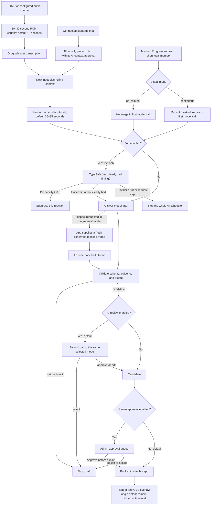

# AI chat flow

This document describes the implemented pipeline from captured inputs to a locally displayed AI chat message. The admin AI card reports the current phase, recent input counts, Jev state, and whether draft review and human approval are enabled.

## Inputs by stage

| Stage              | Information sent                                                                                                                                                                                                                                                                                                                               |
| ------------------ | ---------------------------------------------------------------------------------------------------------------------------------------------------------------------------------------------------------------------------------------------------------------------------------------------------------------------------------------------- |
| Groq transcription | Raw audio as 16 kHz mono WAV chunks. Chunk length is `audio.chunkSeconds` (10 seconds by default). Raw audio is not saved by this app.                                                                                                                                                                                                         |
| Jev, when enabled  | Text only: broadcast description, selected persona, up to 12 new transcript segments, up to 12 new chat messages, up to 12 recent transcript segments, and up to 30 recent chat messages. Speaker labels are the application's pseudonymous display labels. No audio or image is sent.                                                         |
| Answer model       | Broadcast description, persona style, new transcripts and approved chat, rolling context, and recent AI/spectator chat context. In `on_request`, the first call has no image; a requested inspection adds up to the currently available fresh masked frame set to a second call. `continuous` supplies recent masked frames in the first call. |
| AI review          | The same context used for the answer, plus the proposed draft. It can reject or edit the draft; it receives no tools.                                                                                                                                                                                                                          |

The rolling text context is `ai.contextWindowSeconds` (120 seconds by default). Transcription chunk length and reply scheduling are independent: after an eligible decision, the next randomized wait is selected from `ai.pacing.minSeconds` and `ai.pacing.maxSeconds` (35–95 seconds by default). New distinct transcript or permitted chat input may be considered at the next eligible scheduler tick; previously consumed input is not replayed as new.

Platform chat is excluded from AI context unless that platform's `*AiContextApproved` setting is enabled after review. Approval settings are operator records and do not grant platform permission. The admin AI status exposes the last counts of new/context transcript and chat entries and frame count, along with which platform context approvals are active.

## Decisions and review

Jev has one purpose: suppress only when the moment is clearly bad for a chat message. A probability at or above `ai.gate.threshold` (default 0.8) is the veto. Uncertain or neutral scores pass to the answer model. Jev cannot draft messages, assess whether a message is interesting, or provide visual judgment. A timeout, provider error, malformed response, or exhausted Jev request cap stops the entire AI scheduler; an operator can resolve the cause and start AI again. Jev requests have a per-process cap, separate from answer model call and monetary budgets.

The answer model can say, skip, or request `inspect` in `on_request` mode. Inspection is an application-controlled second generation call, not a model tool. The application checks frame freshness and confirmation before supplying images. Outputs must match a structured schema and cite valid evidence; text length and several obvious unsafe patterns are also checked. These checks do not guarantee factuality or safety.

`ai.reviewDraft: true` adds a second call to the same selected answer model for each candidate. The reviewer can reject or make a constrained edit, and evidence is validated again. Because it uses the same model/provider, it is not an independent reviewer and is not a safety guarantee. Both generation, inspection and review calls count toward `ai.maxCalls` and applicable provider budgets.

`ai.manualApproval: false` publishes an accepted message directly into this application's local event stream after AI review. Setting it to `true` adds a human review queue; pending drafts expire after 30 seconds and can be invalidated by stopping AI or stale/hidden evidence. The app does not post AI messages to YouTube, CHZZK, or SOOP. Reader and overlay use the same pseudonymous presentation as other messages until origins are explicitly revealed.

## Available tools and boundaries

The answer model and AI reviewer have **no callable tools**. The status field `availableTools` is empty. They cannot post platform chat, control capture, inspect files, query platform APIs, or execute actions. The application itself may perform the `inspect` follow-up based on a model decision; it validates state and only attaches masked images. Prompt context consists of the inputs above, not private account credentials or the origin table.
