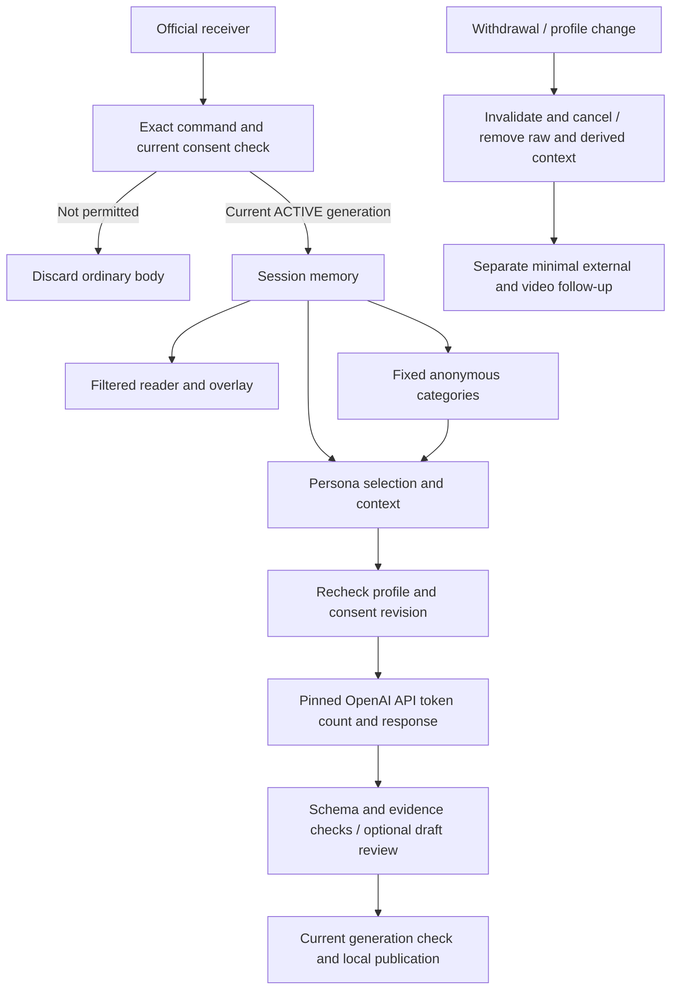

# AI chat pipeline and improvement guide

The live profile is consent-gated, text-only OpenAI API processing. [Privacy implementation](docs/privacy-implementation.md) owns the data-boundary requirements; [development](docs/development.md) owns fixture commands.

## Runtime scope and startup

`createApp` always constructs an in-memory Store. Live mode additionally installs Participation, blocks unapproved receiver scopes and pins the model adapter to the privacy profile. Startup requires a complete profile, matching API model/key and disabled third-party gate, not audio/video. AI requires manual start after restart. Automatic persona creation uses local synthetic templates rather than viewer histories or operator authoring.

Legacy ChatGPT, audio, video, Jev, persistent Store and persona authoring libraries remain testable independently. They are not enabled live paths; changing their legacy config does not bypass the server guards. Demo uses artificial data and a mock model.

## Withdrawal and anonymous chat summaries

- Every raw-message admission and public projection checks the current platform/broadcaster/session/account consent generation. General text from nonparticipants is discarded before message/event storage. Private IDs, original names and consent records are absent from model DTOs.
- Withdrawal invalidates the generation synchronously, erases raw messages and orphan mappings, aborts work and clears queued drafts/cache/manifests. Tracked directly or indirectly dependent AI messages are removed conservatively. Late responses cannot publish. External processing already started is not described as undone.
- Local summary creation considers currently permitted recent human chat only. It emits fixed topic/mood labels supported by at least three distinct accounts, without quotes, personal stories, links or provenance tables. Counts/regular expressions alone do not certify legal anonymity. No external summary request is made.
- The strict live anonymous area retains categories approved before withdrawal for the rest of the current session; withdrawn text is never used to rebuild them. No account/message/source mapping is stored in that area. Session close/reset clears it. Admin **채팅 요약 초기화** clears the aggregate with a sequence cutoff and invalidates current work.
- Model request IDs are associated with participants only in memory. Withdrawal creates a separate minimal rights task if text was displayed or requests were associated. App deletion, provider handling and VOD/copy handling remain distinct.

## Runtime overview

## Stage reference

### 1. Audio capture and transcription

Disabled in the live profile at capture/transcribe boundaries. No FFmpeg/audio upload, transcript log or export. Standalone transcription tests cover legacy utilities only.

### 2. Video capture and masking

Disabled live because screen chat cannot be reliably consent-filtered. No frame upload, preview-confirmation gate or implicit image fallback. Synthetic demo capture remains available.

### 3. Event selection and scheduler

New permitted human text triggers evaluation within `ai.contextWindowSeconds`; synthetic replies alone do not trigger loops. Random pacing, global/per-character cooldown, session budgets and busy-chat suppression apply. Current message DTOs, recent synthetic replies, automatic persona style and approved fixed summaries are explicit model context. Consent revision is captured with the input. Queue, review and publication invalidation uses the existing scheduler/persona cancellation controls.

### 4. Jev timing veto (optional)

Legacy utility only. Enabling it blocks live readiness rather than transmitting text to TypeSafe.

### 5. Answer generation and inspection

The adapter checks profile/model/revision, absence of live frames/transcripts and current permission for every input message before token counting and again immediately before Responses. Both calls use the configured OpenAI endpoint; no silent region/provider fallback. Requests have `store:false`, bounded input/output, strict output schema, no provider tools, persistent conversation, `previous_response_id`, files or opaque retained context. The live profile cannot satisfy image inspection requests.

### 6. AI draft review (default enabled)

The same approved model may reject or lightly edit a proposed response; it is not independent moderation. It receives the same consent/profile checks and cancellation. Schema, length, evidence/reference and obvious unsafe-pattern checks remain. Detection is imperfect; administrator hiding and rights-request handling remain necessary.

### 7. Human review and local publication

Optional manual approval adds an expiring queue. Stopping, withdrawal, removed evidence or stale generation prevents publication. Approved AI messages enter only the local memory stream and its reader/overlay. There is no AI native-platform sender.

## Prompt and tool inventory

Live response/review prompts live under `prompts/`; model serialization is in `packages/model.ts`, consent in `packages/participation.ts`, projection/summary/deletion in `packages/storage.ts`, and authorization wiring in `apps/server/app.ts`. The model receives no tools or rights-queue data. Fixed platform guidance is rendered from the reviewed public profile, never generated by AI or interpolated with viewer text/nicknames.

## Fast improvement workflow

Change prompts or scheduler behavior with synthetic fixtures. Run `sh run-command.sh npm run check` and the browser checks after UI changes. Never copy real chat, screenshots, API credentials or SDK debug payloads into fixtures, logs or reports. Check both withdrawal cancellation and current-generation validation when changing queue behavior.

## Configuration and live visibility

Use [config.example.yaml](config.example.yaml), [live setup](LIVE_SETUP.md) and the admin operating-profile panel. `privacy` is public configuration, not a credential store. Default blank fields fail closed. A current-process profile PUT stops inputs/generation, invalidates consent and removes previous raw context; persistent changes belong in YAML. Budgets are current-session memory; provider account limits are separate.

## Privacy and boundaries

`store:false` is not proof that all provider logs are erased. Actual account data controls, region/model eligibility and retention must match the notices; see [OpenAI data controls](https://developers.openai.com/api/docs/guides/your-data). Local cancellation cannot retract network bytes already delivered. Host swap/crash captures and external video copies require operator review. Session end clears all ordinary app context; exceptional rights tasks and credentials have separate storage and purpose.
