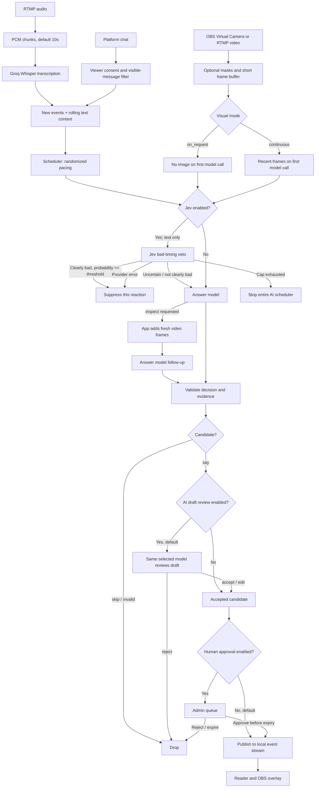

# AI chat pipeline and improvement guide

This is the implementation reference for understanding and improving the chat pipeline. It documents what each stage receives, the exact prompt or request fields, available tools, outputs, budgets, failure behavior, runtime indicators, and source files to edit. Keep this page in sync whenever prompts, schemas, inputs, tools, provider calls, or scheduler transitions change.

## Runtime scope and startup

This page describes the shared response pipeline. [Persona studio](docs/ai-viewer-persona-system-spec.md) adds authoring, approved cast snapshots, presence-limited context, weighted selection, session controls and publication checks. Without an active live persona session, YAML `ai.personas` supplies the characters. Candidate generation uses a separate prompt in `packages/persona/generator.ts`; it does not use `prompts/answer.md`. Auditions use the shared answer model with twelve text fixtures. Authoring usage is not a unified part of the live scheduler budget.

The production entry point starts configured receivers, capture and transcription for an open stream session. On restart it may restore persisted AI running intent or an armed persona session after fresh-frame and readiness checks. Capture no longer requires a `programConfirmed` configuration flag. Mask/preview confirmation has also been removed. Saved-intent recovery requires fresh video and ready audio/model inputs; legacy flag values are ignored. Stop AI before shutdown to clear the running intent. In-flight persona reactions are canceled on restart.

Live AI start currently requires fresh video capture, running audio input and a ready model in **both visual modes**; platform receivers are optional. `on_request` omits images from the first inference and permits text-only ticks after start, but is not a text-only startup configuration. See `scheduler.readyCheck`, `readyComponents` and `resumeAiIfRequested` in [app.ts](apps/server/app.ts).

## Runtime overview

## Stage reference

### 1. Audio capture and transcription

- **Purpose:** turn speech into text observations for later AI decisions.
- **Input:** configured RTMP/RTMPS audio feed. FFmpeg converts it to 16 kHz, mono, signed 16-bit PCM chunks; `audio.chunkSeconds` is 10–30 seconds (default 10). Near-silent chunks are skipped; a chunk is dropped if the previous transcription request is still in flight.
- **Provider request:** multipart upload to Groq `whisper-large-v3-turbo`, `response_format=json`, WAV file. If `audio.language` is nonempty (for example `ko`), it is sent as a language hint; empty means provider auto-detection. This guides recognition but cannot guarantee the language or transcript is correct.
- **Output:** transcript text, capture timestamp and generated transcript ID. Recent entries are kept in memory for 120 seconds, capped to the latest 12 entries; successful transcripts are also retained in local SQLite according to `retentionDays`. Raw audio is not saved by this app.
- **Tools:** none. This is a transcription API request, not an agent with tools.
- **Budget/failure:** `audio.maxRequests` caps requests per process. A process restart resets the count. Provider errors update transcription status; cap exhaustion stops audio capture.
- **Runtime checks:** Admin → **Groq speech transcription** shows input language, provider state, requests, latest transcript and retained transcript history.
- **Source:** `workers/audio.mjs` (FFmpeg/chunking), `packages/transcription.ts` (Groq request, language hint, retention), `packages/config.ts` (`audio` settings).

### 2. Video capture and masking

- **Purpose:** provide visual evidence when the selected AI mode can use images.
- **Input:** either the configured local camera device (OBS Virtual Camera in Program mode) or configured private RTMP reader URL. The production entry point starts configured capture for an open session. Admin **Start capture** can start it again; Start AI also starts stopped inputs before checking readiness.
- **Processing:** FFmpeg emits frames at `capture.intervalMs` (1–5 seconds). Optional configured rectangles are applied locally before resizing and memory buffering. Up to 10 frames / 30 seconds are kept; model requests use at most three recent frames, each no older than 10 seconds. Frames are never persisted by this app.
- **Availability:** no mask configuration or preview confirmation is required. Source size changes discard old frames and continue receiving automatically. Capture failure/stop clears the buffer. Cited frame IDs must remain available and fresh before publication.
- **Modes:** `on_request` has no image in the first answer-model call; an `inspect` decision may cause an app-mediated follow-up with fresh video frames. `continuous` requires fresh frames before AI can start and supplies them in the initial call.
- **Tools:** the model cannot control the camera. `inspect` is a structured model decision interpreted by application code after freshness and confirmation checks.
- **Runtime checks:** Admin → **Program input** shows source backend/device, dimensions, latest-frame age, frames received in the last minute, capture error and input metadata. A stale preview is cleared after 10 seconds. `No frames received` with state `connecting` means the input is not producing a decodable frame yet; `failed`/`reconnecting` includes the FFmpeg exit information.
- **Source:** `packages/capture.ts` (child lifecycle, memory buffer, freshness), `workers/capture.mjs` (FFmpeg, masking and resize), `apps/server/app.ts` (status API and preview endpoint).

### 3. Event selection and scheduler

- **Purpose:** decide whether a new observation is eligible for an AI call and independently pace reactions.
- **New inputs:** unseen transcript IDs and new/changed permitted chat message versions. In `on_request` mode, at least one new transcript or permitted chat event is needed. Already consumed events are not replayed as new.
- **Context:** surrounding transcripts and permitted chat in the rolling `ai.contextWindowSeconds` window (default 120 seconds). Platform messages require viewer consent and must remain visible. All supported platforms are allowed by `Scheduler.allowed()`; per-platform model-context approval flags no longer exist. The application also supplies the persona's previous locally published replies through recent chat context.
- **Eligibility controls:** noisy spectator chat (>15 external messages/minute), already frequent AI speech (3/minute), per-persona cooldown (`ai.pacing.minSeconds`), and repeated input/frame hashes can suppress a call before a provider is contacted. After a decision, the next delay is an integer randomly selected from `ai.pacing.minSeconds` to `maxSeconds` (defaults 35–95 seconds), independently of audio chunking.
- **Current payload counts:** `lastInput` records new/context transcripts, new/context messages, and frames for the latest eligible attempt; it does not expose the text itself. The admin has a retained transcript log and message conversation for inspecting actual observations.
- **Persona branch:** an active live cast adds presence-window filtering, participation probability and weighted member selection, member cooldown, activity-band caps and epoch/hash checks before publication. These constraints supplement the common pacing and rate limits above. See the [persona specification](docs/ai-viewer-persona-system-spec.md) for policy defaults and fields not yet wired into runtime.
- **Source:** `packages/scheduler.ts` (`tick`, event dedupe, eligibility, pacing, phase changes), `packages/storage.ts` (`context` and retained messages), `packages/config.ts` (bounds/defaults).

### 4. Jev timing veto (optional)

- **Purpose:** answer only: “Is this clearly a bad time to add one short fictional spectator message?” It is not a relevance ranker or reply generator.
- **Input:** JSON state includes broadcast description and selected persona; up to 12 recent transcript texts (1,000 chars each) and up to 30 recent chat entries (speaker label up to 80 chars, text up to 1,000). The current gate does not serialize separate new-input arrays. It includes text only: no audio, image, credentials, or origin table.
- **Editable prompt files:** [`prompts/jev_timing.md`](prompts/jev_timing.md) is the main Jev instruction; [`prompts/jev_criteria_true.md`](prompts/jev_criteria_true.md) and [`prompts/jev_criteria_false.md`](prompts/jev_criteria_false.md) define the Noul labels. Edit these text files directly. Runtime loading and request assembly live in [`packages/gate.ts`](packages/gate.ts), `DecisionGate.allow()`. If changing the response key or output shape, also update `gateResponse` and scheduler threshold handling.
- **Output schema:** `{ answers: { should_respond: { type: "noul", noul: number 0..1 } } }`.
- **Wire-name caveat:** `should_respond` is the actual response key, but the prompt asks whether timing is bad. A high score suppresses a response despite the key name.
- **Policy:** when probability is at least `ai.gate.threshold` (default 0.8), suppress only this reaction. Below threshold, pass to answer generation. A provider error, timeout or invalid response suppresses that reaction and allows later new inputs. Cap exhaustion stops the scheduler with `gate_budget_exhausted`. Missing credentials throw and stop it with `model_error`. Jev uses `ai.gate.timeoutMs` (default 3 seconds); its request count/billing is separate from answer-model budgets.
- **Prerequisites:** `ai.visualMode: on_request` and `TYPESAFE_API_KEY` for live mode; no second policy-enable flag exists. Demo bypasses Jev.
- **Runtime checks:** Admin AI card shows gate state, requests/cap, bad-timing veto count, errors and probability/threshold.
- **Source:** `packages/gate.ts` (request payload, exact question, parse and threshold), `packages/scheduler.ts` (veto/fail-stop policy), `packages/config.ts` (gate settings and compatibility validation).

### 5. Answer generation and inspection

- **Purpose:** draft one short Korean fictional-spectator response, skip, or request visual inspection.
- **Editable prompt file:** [`prompts/answer.md`](prompts/answer.md). Change the text there; `{{persona_style}}` and `{{visual_instruction}}` are runtime placeholders. Prompt loading and the adjacent model input serialization are in [`packages/model.ts`](packages/model.ts), function `modelMessages(input)`. Update [`packages/contracts.ts`](packages/contracts.ts) if the model’s allowed decisions or evidence format changes.

- **Input fields:** `description`; `reviewDraft` (null for generation); `recentContext` (`messages`); `newMessages`; `newTranscripts` and `recentTranscripts` (IDs, capture times and text); `frames` metadata (IDs/timestamps) plus each frame as a low-detail JPEG data URL. Optional configured masks are applied before serialization; no mask is required. `persona.style` is in the system prompt; the persona name is used for published local identity and by Jev, not serialized as a separate answer payload field.
- **Actions:** `say` (draft text and evidence), `skip` (no message), or `inspect` (only honored in `on_request` without frames; app validates current fresh frames then calls the model again). Inspection is not a callable tool and cannot choose a URL, file or camera source.
- **Output schema:** strict JSON fields `action`, `text`, `replyToMessageId`, `evidenceFrameIds`, `evidenceMessageIds`, `evidenceTranscriptIds`; action enum is `say | skip | inspect`. `say` requires nonempty text <=120 Unicode characters, at most two lines, and at least one evidence ID. Evidence/reply IDs must exist in current input. Output is checked for several obvious unsafe patterns. These checks do not prove truth or guarantee safety.
- **Provider calls:** OpenAI API mode sends Responses API with strict JSON schema, `store:false`, configured output token limit, and first performs input token counting. ChatGPT subscription mode sends the same prompt/schema to Responses API with `store:false`, streaming enabled and waits for completion. Neither enables provider tools. Each request is capped locally at 8 MiB.
- **Budgets/failure:** every generation/follow-up/review call reserves one `ai.maxCalls` call and applicable configured USD budget. Any provider, parse, token-limit or budget error stops AI with a state visible in Admin. Legacy attempt timeout is 30 seconds; persona sessions use `model_timeout_ms` (6 seconds by default); Stop AI aborts the active request.
- **Source:** `packages/model.ts` (`ModelInput`, `modelMessages`, provider requests), `packages/contracts.ts` (strict decision schema), `packages/scheduler.ts` (`inspect` orchestration, budget reservations, validation), `packages/config.ts` (model limits).

### 6. AI draft review (default enabled)

- **Purpose:** reject or make a constrained edit to a generated draft before any human queue or local publication.
- **Input:** same `ModelInput` and evidence as the answer pass, plus `reviewDraft` containing the proposed text. If visual inspection occurred, video frames remain available as evidence.
- **Editable prompt file:** [`prompts/review.md`](prompts/review.md). Change the text there. The draft is supplied as the user JSON field `reviewDraft`; its serialization is in [`packages/model.ts`](packages/model.ts), function `modelMessages(input)`. Keep permitted `say`/`skip` outcomes aligned with validation and scheduler handling.

- **Tools:** none. Same selected model and provider as drafting; it is not independent moderation despite the prompt wording and is not a safety guarantee.
- **Output:** same decision schema. `skip` or `inspect` rejects the candidate; `say` goes through normal validation and evidence checks again. The reviewer cannot initiate another inspection.
- **Config/budget:** `ai.reviewDraft` defaults to true. One extra `ai.maxCalls` unit and provider budget reservation per candidate.
- **Runtime checks:** Admin reports whether review is enabled and total review calls, and shows `ai_review` while the call is active.
- **Source:** prompt in `packages/model.ts` (`modelMessages` review branch); invocation/state in `packages/scheduler.ts`; setting in `packages/config.ts`.

### 7. Human review and local publication

- **Purpose:** optional operator approval after AI review; then publication inside this application only.
- **Human review:** `ai.manualApproval: true` places the final text in Admin. The legacy candidate expires after 30 seconds; persona candidates use their reaction TTL (12 seconds by default, measured from the triggering observation). Either can be invalidated when AI is stopped, session closes, evidence goes stale, or cited content is hidden. Approve publishes locally; reject discards.
- **Automatic mode:** default `ai.manualApproval: false` publishes after validation and optional AI review.
- **Publication boundary:** inserted as an `experiment` message in the local SQLite event stream. This app does not post AI responses to YouTube, CHZZK, or SOOP. Reader/overlay use a blinded pseudonymous representation until origins are explicitly revealed.
- **Tools:** model has none. Only local scheduler code calls the store; human approval is an authenticated Admin action.
- **Source:** `packages/scheduler.ts` (`pending`, `approve`, `reject`), `apps/server/app.ts` (admin routes/status), `packages/storage.ts` (event persistence/public representation).

## Prompt and tool inventory

| AI/provider stage | Prompt/config source                                                                                                                                     | Callable tools | Application-mediated action                                      |
| ----------------- | -------------------------------------------------------------------------------------------------------------------------------------------------------- | -------------: | ---------------------------------------------------------------- |
| Groq Whisper      | Form fields in `packages/transcription.ts`; language from `audio.language`                                                                               |           None | FFmpeg captures audio and creates WAV chunks                     |
| TypeSafe Jev      | [`prompts/jev_timing.md`](prompts/jev_timing.md), `prompts/jev_criteria_*.md`; loaded by [`packages/gate.ts`](packages/gate.ts)                          |           None | Scheduler suppresses a reaction; stops when its cap is exhausted |
| Answer generation | [`prompts/answer.md`](prompts/answer.md); loaded by [`packages/model.ts`](packages/model.ts); schema in [`packages/contracts.ts`](packages/contracts.ts) |           None | May request `inspect`; app can attach fresh video frames         |
| Draft review      | [`prompts/review.md`](prompts/review.md); loaded by [`packages/model.ts`](packages/model.ts); same schema                                                |           None | App may accept/edit/reject; no other follow-up                   |
| Human review      | No AI prompt                                                                                                                                             |            N/A | Authenticated human approves/rejects local pending message       |

No model can call a platform API, post a message, access the filesystem, read secrets, start/stop capture, or invoke an arbitrary HTTP endpoint. `availableTools` in admin status is an empty list. `inspect` is a constrained response action handled by app code, not a model tool.

## Fast improvement workflow

1. **Choose the stage** in the overview and stage reference; confirm its intended responsibility and failure policy.
2. **Inspect actual inputs** using the admin transcript/message views and latest input counts. Never assume a platform source enters context: verify viewer consent, visibility and recent count.
3. **Edit the right artifact:** Jev instructions in `prompts/jev_timing.md` and its criteria files; answer/reviewer prompts in `prompts/answer.md` and `prompts/review.md`; response shape in `packages/contracts.ts`; scheduling/context in `packages/scheduler.ts`; upstream conversion in `packages/transcription.ts` or capture workers; settings/bounds in `packages/config.ts`; runtime visibility in `apps/server/app.ts` and `apps/web/src/main.tsx`.
4. **Keep the schema and docs synchronized.** If adding a model action or tool, define permissions and validation in app code, constrain it in schema, document exact input/output and failure modes here, then expose it in the admin status only if it truly exists.
5. **Validate without paid services:** `npm run build` checks TypeScript and web bundle. Existing fixture tests can check request bodies, schema and failure behavior; they cannot establish model quality. Real provider judgment requires a separately reviewed sample and provider call.
6. **Update this guide** in the same change whenever prompts, payload fields, tools, model providers, budgets, gates, or scheduler phases change.

## Configuration and live visibility

| Setting                               |                 Default | What it changes                                              |
| ------------------------------------- | ----------------------: | ------------------------------------------------------------ |
| `audio.chunkSeconds`                  |                      10 | Speech chunk duration; does not set AI reply cadence         |
| `audio.language`                      |            empty / auto | Whisper language hint (`ko`, `en`, `ja`, etc.)               |
| `ai.contextWindowSeconds`             |                     120 | Surrounding transcript/chat context window                   |
| `ai.pacing.minSeconds` / `maxSeconds` |                 35 / 95 | Random delay after an eligible decision                      |
| `ai.visualMode`                       | `on_request` in example | Image-first (`continuous`) or text-first (`on_request`) flow |
| `ai.gate.enabled`                     |                   false | Enables text-only Jev timing veto                            |
| `ai.gate.threshold`                   |                     0.8 | Jev score at/above which clearly bad timing is suppressed    |
| `ai.reviewDraft`                      |                    true | Adds a same-model review call to each candidate              |
| `ai.manualApproval`                   |                   false | Adds a human approval queue after AI review                  |
| `ai.maxCalls`                         |                     100 | Total answer, inspect follow-up and AI review calls          |

Admin `/api/admin/status` exposes scheduler state/phase, latest context counts, gate counts/probability, call usage, pending draft, review count, and capture state/error/frame freshness. Open the AI pipeline and Program input cards for a fast diagnosis:

- `AI stopped · stopped`: AI is idle; press **Start AI**.
- `AI running · waiting_for_input`: scheduler is alive but no new eligible event is available.
- `AI running · random_wait`: waiting for configured randomized interval.
- `jev_timing_filter`, `generating_draft`, `generating_draft_with_frame`, `ai_review`: provider stage currently active.
- `awaiting_human_review`: draft awaits the operator; other input capture continues.
- `budget_exhausted`, `gate_budget_exhausted`, `model_error`: AI stopped on the named failure; inspect gate/provider status and budgets before restarting.
- `Program input · connecting` with no frame: FFmpeg started but no decodable image has arrived. Check the selected camera/backend, Program output, RTMP URL/network and FFmpeg path.
- `failed` or `reconnecting`: capture worker failed; use the displayed exit/error detail and check OBS output/capture configuration.
- A fresh frame is shown only if it is <=10 seconds old. No preview confirmation is required. `capture.programConfirmed` is accepted only for compatibility and discarded during config parsing.

## Privacy and boundaries

Current configuration has no provider-review flags. Configured audio and a Groq key enable transcription when inputs start. Transcripts and consented visible chat may go to TypeSafe if Jev is enabled and to the selected answer provider. Video frames may go to the answer provider after freshness checks; Jev never receives them. The app does not save raw audio or frame images. Persona authoring persists public planning input in model-run manifests, definitions, audition outputs and review records; live persona attempts also retain decisions and metadata. Do not interpret this as a no-model-data-storage system. Retained transcript/chat logs remain local to the configured database and are subject to retention/deletion settings. Keep API keys, encrypted token files, RTMP URLs and exports private.
