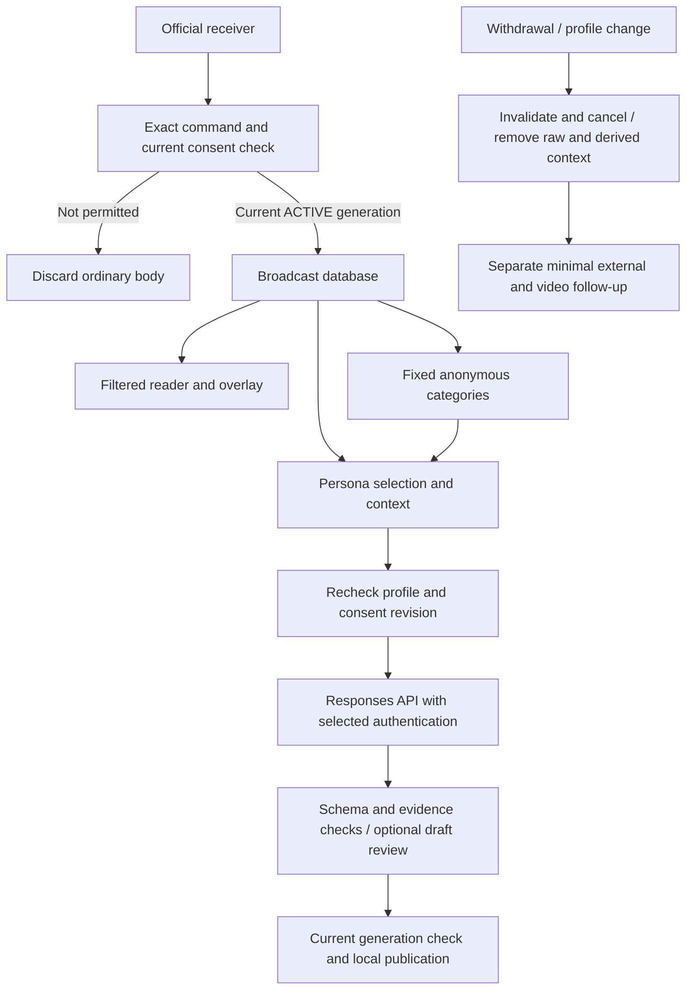

# AI runtime and diagnostics guide

The live profile is consent-gated chat and optional broadcast-transcript and OBS Program image processing through the OpenAI Responses API, with explicitly selected API-key authentication or Sign in with ChatGPT for eligible ChatGPT plan usage. [Privacy implementation](../specifications/participation.md) owns the data-boundary requirements; [development](guide.md) owns fixture commands.

## Runtime scope and startup

`createApp` uses the configured private SQLite database in live mode and an in-memory Store in demo mode. Live mode additionally installs Participation, blocks unapproved receiver scopes and pins the selected API or subscription adapter to the privacy profile. Startup requires a complete profile, matching selected-service model/credentials and disabled third-party gate, not audio/video. AI execution intent survives restart; the recovery loop waits for required inputs and authentication before resuming. Automatic persona creation uses local synthetic templates rather than viewer histories or operator authoring.

Jev and persona authoring libraries remain standalone paths. Live video and broadcast transcription use their configured sources by default. Demo uses artificial data and a mock model.

Broadcast control now belongs to [BroadcastService](../../packages/application/broadcast/service.ts),
with [ports](../../packages/application/broadcast/ports.ts) and thin
[HTTP routes](../../apps/server/http/routes/broadcast.ts). It distinguishes AI stop,
all-input stop, broadcast end and process shutdown. Superseding stop/end commands
cancel a delayed new-broadcast action. Server composition connects the application
owners to input, storage and provider adapters. [Reaction implementation](reactions.md)
describes generation/cast internals; [inputs and accounts](inputs-and-accounts.md)
describes media and platform integration.

## Withdrawal and anonymous chat summaries

- Every raw-message admission and public projection checks the current platform/broadcaster/session/account consent generation. General text from nonparticipants is discarded before message/event storage. Private IDs, original names and consent records are absent from model DTOs.
- Withdrawal invalidates the generation synchronously, erases raw messages and orphan mappings, aborts work and clears queued drafts/cache/manifests. Tracked directly or indirectly dependent AI messages are removed conservatively. Late responses cannot publish. External processing already started is not described as undone.
- Local summary creation considers currently permitted recent human chat only. It emits fixed topic/mood labels supported by at least three distinct accounts, without quotes, personal stories, links or provenance tables. Counts/regular expressions alone do not certify legal anonymity. No external summary request is made.
- The strict live anonymous area retains categories approved before withdrawal for the rest of the current session; withdrawn text is never used to rebuild them. No account/message/source mapping is stored in that area. Session close/reset clears it. Admin **Reset chat summary** clears the aggregate with a sequence cutoff and invalidates current work.
- Model request IDs are associated with participants in the broadcast session database. Withdrawal creates a separate minimal rights task if text was displayed or requests were associated. App deletion, provider handling and VOD/copy handling remain distinct.

## Runtime overview

## Stage reference

### 1. Audio capture and transcription

The configured audio source is transcribed by Groq; recent transcript text can enter the selected Responses API model. Session transcripts support authenticated export. Withdrawal/context invalidation clears speech history and discards in-flight results. No automatic speaker-to-viewer consent mapping is inferred. See [audio setup](../operations/setup.md#broadcast-audio-and-transcription).

### 2. Video capture and inspection

Configured OBS Program frames are available in live mode. Continuous mode supplies fresh visual evidence; on-request mode adds a frame after a supported inspection decision. Frames remain bounded in memory and are invalidated on context reset. There is no mask-confirmation or preview-acknowledgement gate.

### 3. Event selection and scheduler

Enabled AI waits when no new permitted human text or enabled transcript is available; readiness alone does not guarantee generation. New permitted human text or enabled speech triggers evaluation within `ai.contextWindowSeconds`; synthetic replies alone do not trigger loops. Random pacing, global/per-character cooldown, session budgets and busy-chat suppression apply. Current message DTOs, recent synthetic replies, automatic persona style and approved fixed summaries are explicit model context. Consent revision is captured with the input. Queue, review and publication invalidation uses the existing scheduler/persona cancellation controls.

Reaction deduplication uses a hash of the current chat sequence and message,
transcript and frame IDs, scoped to persona session/member. The chat sequence is
still recorded for diagnostics, but it is not the sole identity: fresh speech can
arrive without any new chat event. Duplicate context reservations are skipped
without raising a database uniqueness error. The scheduler catches preparation
errors as well as model failures; unexpected preparation failures stop AI with
`scheduler_error` instead of terminating the server. Legacy standalone databases
migrate the older sequence-only uniqueness constraint without dropping attempts.

### 4. Legacy Jev timing veto (disabled live)

Legacy utility only. Enabling it blocks live readiness rather than transmitting text to TypeSafe.

### 5. Answer generation and inspection

Both adapters check profile/model/revision, configured input availability and freshness/content of transcript evidence and current permission for every input message during preparation and immediately before the Responses API request. Only API-key mode performs token counting, with a permission check before that request too; token counting and inference use the configured endpoint. Sign in with ChatGPT uses its supported public Responses API endpoint without the API-key token-counting preflight. Neither mode silently falls back to another region/provider. Requests have `store:false`, bounded input/output, strict output schema, no provider tools, persistent conversation, `previous_response_id`, files or opaque retained context. Image inspection requires enabled video and current frames.

### 6. AI draft review (default enabled)

The same approved model may reject or lightly edit a proposed response; it is not independent moderation. It receives the same consent/profile checks and cancellation. Schema, length, evidence/reference and obvious unsafe-pattern checks remain. Detection is imperfect; administrator hiding and rights-request handling remain necessary.

### 7. Human review and local publication

Optional manual approval adds an expiring queue. Stopping, withdrawal, removed evidence or stale generation prevents publication. Approved AI messages enter only the local broadcast conversation and its reader/overlay. There is no AI native-platform sender.

## Prompt and tool inventory

Default live response/review prompts live under `prompts/`; versioned [experiment profiles](experiments.md) can select alternate prompts at server startup; model serialization is in [the message renderer](../../packages/infrastructure/reactions/model-messages.ts), consent in `packages/application/participation/service.ts` and `packages/domain/participation/`, context removal/summary coordination in `packages/application/conversation/context-service.ts`, the permitted-message projection in `packages/application/conversation/projection-service.ts`, and authorization wiring in `apps/server/app.ts`. The model receives no tools or rights-queue data. For SOOP, the connected admin SDK automatically sends server-issued fixed notices after unconsented chat when guidance is needed, with pre-send account/global limits and matching broadcaster MESSAGE confirmation. YouTube and CHZZK run their fixed-notice senders on the server while receivers are active; the single notice requires a confirmed platform response. AI replies never use those senders. Fixed platform guidance is rendered from the reviewed public profile, never generated by AI or interpolated with viewer text/nicknames.

## Isolated experiments

Use the [experiment workspace](experiments.md) to compare persona patches, prompts
and pipeline settings with synthetic scenarios. `ai.transcriptLimit` selects one
to ten recent chunks (default ten); it does not extend speech retention.

## Fast improvement workflow

Change prompts or scheduler behavior with synthetic fixtures. Run `sh run-command.sh npm run check` and the browser checks after UI changes. Never copy real chat, screenshots, API credentials or SDK debug payloads into fixtures, logs or reports. Check both withdrawal cancellation and current-generation validation when changing queue behavior.

## Configuration and live visibility

Use [config.example.yaml](../../config.example.yaml), [live setup](../operations/setup.md) and the admin operating-profile panel. `privacy` is public configuration, not a credential store. Default blank fields fail closed. A current-process profile PUT stops inputs/generation, invalidates consent and removes previous raw context; persistent changes belong in YAML. Budgets persist for the current broadcast; provider account limits are separate.

## Privacy and boundaries

`store:false` is not proof that all provider logs are erased. Actual account data controls, region/model eligibility and retention must match the notices; see [OpenAI data controls](https://developers.openai.com/api/docs/guides/your-data). Local cancellation cannot retract network bytes already delivered. Host swap/crash captures and external video copies require operator review. Session end clears all ordinary app context; exceptional rights tasks and credentials have separate storage and purpose.

## Sign in with ChatGPT without an API key

`chatgpt_subscription` uses the app's Sign in with ChatGPT account and selected model, with no API-key/environment-model requirement. The OpenAI Responses API HTTP request uses `store:false`, `stream:true` and explicit required history in `input`, with no tools/chaining. Inference succeeds only after `response.completed`; deltas alone, interrupted streams and failed/incomplete terminal events do not qualify. The same current-consent guard runs before preparation and after asynchronous token refresh immediately before sending; account/model changes during refresh abort the call. Request IDs enter the same withdrawal follow-up mechanism. Subscription requests do not use API-key token counting or API USD pricing; local call/size and reported token limits still apply. Contract/profile mismatches stay blocked.

The explicit [operator-reviewed test configuration](../specifications/participation.md#operator-reviewed-test-configuration) can defer descriptive profile metadata during reviewed testing. Viewer consent, withdrawal, channel approval, model compatibility and actual notice limits remain required.

## Per-attempt failures and AI enablement

Expired/replaced transcript context and rejected or invalid model decisions discard
only the current attempt. AI remains enabled and waits for new input at the normal
configured pace; the discarded input is not replayed automatically. Transient
network/timeout failures may continue on fresh input, but three consecutive such
failures stop generation. Authentication/provider failures, privacy restrictions,
call budgets and unexpected scheduler failures still stop AI.

The admin status exposes a sanitized `ai.lastIssue` category, timestamp, explanation
and continuation flag; the dashboard shows the explanation next to AI controls.
Raw provider payloads or transcript bodies are not included in this diagnostic.
Current transcript evidence is revalidated before each model request, including
draft review. A generic historical error without structured diagnostics cannot
establish the cause of a past stop.

## Review and diagnostics

Before draft review, expired background transcripts are removed from both the
context and new-transcript lists. If a draft cites an expired transcript, that
attempt is discarded instead. Review still rechecks the original privacy revision
and all current permissions; expiration cleanup never authorizes withdrawn data.

AI diagnostics retain the last 100 structured events in authenticated
`/api/admin/status` under `ai.diagnostics`. The managed server also writes these as
`ai_diagnostic` JSON lines to `.local/server.log`. Events distinguish generation
and review requests/results, review rejection, expired context, and publication or
candidate discard. They contain timestamps, stages, validated decision actions,
counts, durations and fixed reason codes, never chat/transcript/draft text, names,
credentials or raw provider errors. A reviewer `skip` is recorded as a rejection;
its internal rationale is not inferred or logged. Logs are local diagnostics, not
proof that a browser displayed a published message.

New persona sessions allow 30 seconds total for generation plus review, with a
45-second reaction lifetime measured from the triggering observation. Existing explicit session
policies are not rewritten. Evidence expiry, withdrawal and session changes can
still discard a result sooner; this is not an extension of transcript retention.

## Provider error classification

Sign in with ChatGPT failures now distinguish HTTP status, interrupted streams,
invalid output, and input/output token-limit violations. The latter log only actual
and configured token counts. Authentication/permission errors and configured token
limits stop generation; transient HTTP 408/429/5xx and interrupted streams use the
existing three-consecutive-failure bound with fresh input and normal pacing. No
partial streamed text is published and no other account/provider is tried.

The [Sign in with ChatGPT preview limitations](https://developers.openai.com/siwc/token-sharing-open-source/preview-limitations)
exclude `max_output_tokens`, so this adapter continues to omit that request field.
Its local output-token check uses reported total usage, which includes non-visible
tokens as described in [Counting tokens](https://developers.openai.com/api/docs/guides/token-counting).
An earlier generic `model_error` cannot be retroactively assigned a precise cause
without the original detailed evidence.

## Review and publication validation

Model-output parsing is owned by the shared
[decision contract](../../packages/contracts/decision.ts); evidence membership,
length and output restrictions are checked by a
[pure policy](../../packages/domain/reactions/decision.ts) through the application
validator. Review may remove expired background transcript chunks, but must reject
a draft when its cited speech expired.

The [publication policy](../../packages/domain/reactions/publication.ts) rechecks
broadcast identity, generation, running/closed state, consent revision, the exact
candidate deadline, current message contents and cited media availability.
Keeping the same message identifier does not permit publishing a response to text
that was edited during generation or manual review. Expired or invalid candidates
are discarded before scheduling another delay; diagnostics record only a fixed
reason. The [application coordinator](../../packages/application/reactions/coordinator.ts)
owns provider calls, usage reservation and durable publication coordination through
explicit ports. Node clocks, hashing and concrete store/input adapters are wired
in the infrastructure composition.

## Reaction policy ownership

[Evidence selection](../../packages/domain/reactions/evidence.ts) and
[cast eligibility/selection](../../packages/domain/reactions/cast-selection.ts)
are pure domain policies. They accept the current time and injected random draws,
keep new input separate from background, and do not consume evidence merely
because pacing or a quota blocks an attempt. By default, the latest ten transcript chunks are
selected by capture time. Member presence restricts all selected message, speech
and frame evidence; each member's new evidence remains a subset of that context.
The scheduler's duplicate key includes a hash of an edited message's current
version, so an unchanged platform identifier does not suppress updated text.
It includes every unconsumed human message and transcript identifier, so a delayed
older transcript chunk is not suppressed merely because a newer chunk was already
processed. Generation, review and publication orchestration belongs to the application coordinator.

## Questions, transcript context and readable images

By default, generation receives the latest ten available transcript chunks within the configured
context window, further limited to the selected persona's presence. Review uses the
same context after removing expired background. `newTranscripts` is the unconsumed
subset, not the total speech input; `contextTranscripts` reports the context count.
Fewer than ten available/current chunks are sent without padding or fabricating
speech. Unconsumed observation eligibility covers configured pacing plus the model
deadline, capped by the context window, so waiting alone does not expire a question
after twelve seconds. Candidate lifetime uses the newest supplied triggering input.

Generation and review prioritize answering direct questions over merely acknowledging
a test. Screen-reading answers must come from readable image evidence or explicitly
state that the text is illegible. Continuous capture and inspection supply the latest
single frame at `detail: high` rather than several low-detail frames. This improves
visual detail while limiting redundant image context; see the official
[image-detail guidance](https://developers.openai.com/api/docs/guides/images-vision).
