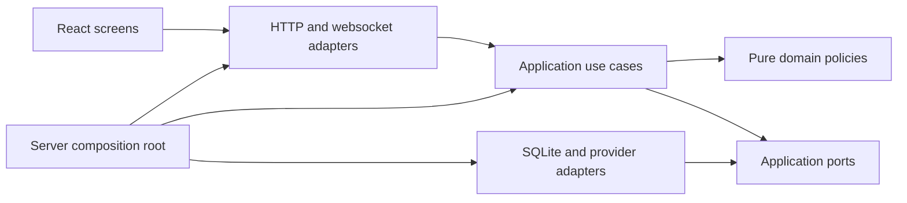

# Architecture and reconstruction contract

This is the implementation target for rebuilding the existing product. It is not
a claim that all boundaries below already exist. The accepted behavior is owned
by [behavior](../specifications/behavior.md), [participation](../specifications/participation.md)
and [personas](../specifications/personas.md). The [dashboard contract](../specifications/dashboard.md)
defines the replacement UI. The microphone-only mode is outside this rewrite.

## Scope and precedence

Preserve the working live flows: configured screen and speech, selected platform
chat, fixed participation notices, individual consent and withdrawal, automatic
six-person cast, inference and review, reader/OBS overlay, account connections,
usage limits, broadcast recovery and rights handling. Existing code is evidence
of protocol behavior, not the architecture to preserve. A defect or obsolete
manual-authoring experiment does not become a requirement because it has a test.

The latest accepted changes override older private source documents: broadcast
state survives process restart; broadcast end destroys it; consent uses one
short confirmed notice and one fresh command; recently observed viewers can
share delivery; broadcast accounts are excluded; configured video/audio need no
privacy enable flags; forced-reply and broadcaster test modes are removed.

Keep Node, TypeScript, Fastify, React, Vite, SQLite and existing provider SDKs.
Do not introduce a service framework, message broker, dependency injection
container, generic repository hierarchy or a second production runtime. Prefer
small named functions and explicit constructor dependencies.

## Dependencies and ownership

| Location                   | Responsibility                                                                                        | Must not own                                                                    |
| -------------------------- | ----------------------------------------------------------------------------------------------------- | ------------------------------------------------------------------------------- |
| `packages/domain/`         | Pure broadcast, participation, evidence and reaction policies; explicit values and outcomes           | HTTP, SQL, provider clients, timers, environment reads                          |
| `packages/application/`    | Use cases, lifecycle coordination, cancellation, ports and application projections                    | Fastify/React objects, provider JSON, ad-hoc SQL                                |
| `packages/infrastructure/` | SQLite repositories/migrations, credential storage, platform and inference adapters, worker processes | UI decisions, independent consent decisions, broadcast lifetime policy          |
| `packages/contracts/`      | Validated HTTP/websocket/configuration DTOs used at boundaries                                        | Service instances or secrets in public DTOs                                     |
| `apps/server/`             | Composition, HTTP security, route registration, websocket delivery and process lifecycle              | Participation rules, AI selection logic or database queries in route handlers   |
| `apps/web/src/`            | Typed API client, session hooks, feature screens and reusable presentation components                 | Provider tokens in browser storage, server policy decisions, raw state mutation |
| `workers/`                 | Bounded audio/video and incompatible SDK process isolation                                            | Broadcast state or permission decisions                                         |

Flat legacy modules may remain during replacement. A temporary adapter can connect
a new use case to an old module while its replacement is under test. Final
completion requires removing superseded runtime paths, not leaving a permanent
facade over the same monolith. Each file should have one reason to change; split
by responsibility, not by an arbitrary line-count target.

## Application services

| Owner               | Public operations                                                                            | Durable responsibility                                                            |
| ------------------- | -------------------------------------------------------------------------------------------- | --------------------------------------------------------------------------------- |
| Broadcast lifecycle | Start inputs, enable/disable AI, close/new broadcast, disclose, reset data, shutdown/recover | Session identity, closed marker, desired AI state                                 |
| Participation       | Classify commands, record delivery, accept fresh consent, block age, withdraw                | Participant state, consent epoch/version, delivery opportunity, replay protection |
| Notice delivery     | Choose pending room guidance, reserve rate budget, send, confirm/reject result               | Confirmed delivery and rate reservations; no arbitrary text send capability       |
| Conversation        | Admit permitted messages, edit/hide, project public state, collect model context             | Chat, opaque speaker identities and publication dependencies                      |
| AI reactions        | Select fresh context and persona, generate, review, optionally approve, publish              | Usage reservations, attempt state, bounded sanitized diagnostics                  |
| Cast                | Compose/reuse six synthetic viewers, select eligible members, record presence/speech         | Definitions and broadcast cast; no real-viewer profiling                          |
| Inputs              | Manage configured screen, speech and selected platform adapters                              | Checkpoints and transcription usage; raw media is transient                       |
| Accounts            | Authorize/select/forget supported accounts and model                                         | Encrypted credentials, separate from broadcast records                            |
| Rights              | Intake, minimal follow-up, outcomes and deletion                                             | Separate rights database, retained beyond broadcast end as required               |
| Status              | Project actual readiness, desired versus effective execution, scoped API errors              | No independently mutable copy of runtime state                                    |

Ports describe only operations their consumer uses. Repository adapters implement
explicit queries and transactions, not generic `get/set<any>` bags. HTTP handlers
validate requests, call one use case and map its outcome. Cross-service workflows
belong in application code, not route callbacks or implicit EventEmitter chains.

## Broadcast and execution lifecycle

Broadcast state and process state are distinct. The broadcast is `open` or
`closed`. AI has durable enabled/disabled intent and transient running/waiting/error
state. Restart does not create a new broadcast or imply withdrawal. Inputs have
independent configured, starting, receiving, unavailable and stopped states.

| Trigger                                 | Required transition                                                                                                 |
| --------------------------------------- | ------------------------------------------------------------------------------------------------------------------- |
| Enable AI                               | Validate readiness, start needed configured inputs, reuse/create the cast and enable generation                     |
| Disable AI                              | Persist disabled intent and cancel generation/review/publication; input collection remains independently controlled |
| Stop all inputs                         | Disable AI, cancel pending work and stop every input adapter                                                        |
| Process shutdown                        | Stop transient work, preserve intent/session, close resources; do not end the broadcast                             |
| Process startup                         | Load the same session, cancel incomplete attempts and recover enabled AI after required inputs/model are ready      |
| Input temporarily unavailable           | Show the cause; never fabricate healthy input or declare broadcast end                                              |
| Explicit or authoritative broadcast end | Disable AI, invalidate pending work, stop inputs, atomically erase broadcast data and retain a closed marker        |
| New broadcast                           | Finish the previous session, create a new identity with AI disabled and fresh participation/cast state              |
| Disclosure                              | Stop AI and make origin labels irreversible for this broadcast; retain actual displayed names                       |

Concurrent lifecycle commands must have a defined order. Stop/cancel takes effect
before awaiting an adapter shutdown. No delayed start, model result or notice
acknowledgement can reopen a closed broadcast. Shutdown and end must be separately
testable operations, with resources closed exactly once.

## Ingestion, consent and withdrawal

1. Normalize the external event at the adapter boundary; retain original event
   ordering when available and never invent a provider timestamp.
2. Exclude the broadcast account and configured bots. Classify exact commands
   before any public storage or model context admission.
3. Store only minimal state for a nonparticipant. Never retain their ordinary
   message body in the database, diagnostics, browser state or summaries.
4. Send one fixed notice with its public URL. Confirm actual delivery using the
   provider's supported acknowledgement; unconfirmed sending is not delivery.
5. Share that delivery with the target and waiting viewers observed in the same
   room within five minutes. Unknown later arrivals are not assumed present.
6. Require each viewer's fresh command after delivery. Preserve ordering, notice
   version, account, platform, broadcaster and broadcast identity boundaries.
7. Admit only messages after that viewer's current consent generation.

The [consent policy](../../packages/domain/participation/consent.ts) is a pure
state transition over explicit time, profile availability and observation identity.
It returns the next participant, permission result and invalidation revision;
it performs no persistence, identifier generation or callbacks. The legacy
participation coordinator currently applies these transitions to its stored
participant references and invokes downstream invalidation. The [guidance policy](../../packages/domain/participation/notices.ts) separately
decides rate reservations and room-scoped delivery opportunities without treating
either as consent. It rejects another reservation for an already-covered viewer.
Provider scheduling, profile replacement and snapshot storage remain separate
reconstruction work.

Withdrawal must commit consent invalidation and local raw/dependent deletion in
one storage transaction, then invalidate running work and refresh all projections.
External-request authorization is rechecked after asynchronous preparation and
immediately before transmission. Late provider results must pass the same current
permission checks before publication. Only previously approved coarse anonymous
categories can survive withdrawal; they expire at broadcast end.

## AI pipeline

Separate input selection, pacing/eligibility, persona selection, model request,
review and publication. Use injected time/randomness at policy boundaries so tests
do not depend on sleeps or probability. Context includes the latest ten recent
transcript chunks, eligible human text and configured visual evidence. New input
and background context are distinct; input received during pacing remains eligible.

The provider port supports API-key authentication and Sign in with ChatGPT using
the Responses API. Preserve working authentication, token-counting, streaming,
storage settings and bounded concurrency. Do not replace tested wire protocols
with assumptions. A provider cannot silently switch account or authentication.

Every attempt carries broadcast/context/consent and cast revisions. Review and
publication validate those revisions, cited evidence, expiry, duplicate and
frequency rules. Silence is a normal result. Failures distinguish authentication,
quota, local budget, token bounds, timeouts and invalid output. Diagnostics contain
fixed categories/counts/IDs, never raw input, drafts or credential payloads.

## Persistence and external effects

One private SQLite broadcast database owns session-scoped records; a separate
rights database and encrypted account files have independent lifetimes. Keep the
current configured database usable through explicit, tested schema migrations.
Do not silently select another file, discard an open broadcast or start a fresh
session to make a migration pass. Runtime DB handles remain inside adapters.

Durable writes precede externally visible publication or acknowledgement. Provider
writes remain at-least-once where remote acknowledgement is ambiguous; do not
claim exactly-once delivery. Confirmed notices and usage survive restart. On end,
remove chat, consent, summaries, transcripts, cast, pending work and broadcast
budgets atomically, then checkpoint/compact according to the storage adapter.

Raw PCM and frames stay bounded in memory. Browser storage must not contain chat,
transcripts, consent records or credentials. Transcript downloads are explicit
administrator actions and remain outside automatic deletion. Reader projections
never contain administrator-only account, consent or rights data.

## UI and contracts

Build a new operator workspace, not more sections inside the current page.
Separate the broadcast dashboard, connections/settings, and participation/rights
screens. Keep reader and overlay routes focused on conversation. Use a single
status query owner and mutation client; feature components consume typed DTOs.
The SOOP browser adapter has its own lifecycle hook and cannot be duplicated by
page navigation. Keep server-derived eligibility distinct from presentation labels.

Preserve existing reader links, OAuth callbacks and supported live administrator
operations during cutover. Replace unstable internal DTOs deliberately and update
consumers/tests together. Legacy persona-authoring APIs that are blocked in live
mode are reference material, not a second product to rebuild. Synthetic demo
inputs remain available to exercise the actual application pipeline.

## Reconstruction and acceptance

Implement in functional slices: lifecycle, participation/conversation/storage,
input and account adapters, AI/cast, HTTP/status, then the replacement workspace
and public surfaces. Update ownership documents as each target becomes real.
Avoid two complete production implementations or unrelated speculative features.

| Contract                         | Required executable evidence                                                                                                                              |
| -------------------------------- | --------------------------------------------------------------------------------------------------------------------------------------------------------- |
| Broadcast identity and AI intent | Graceful and abrupt restart, waiting readiness, explicit stop and closed-marker tests                                                                     |
| Consent and shared guidance      | Fresh/stale/replayed commands, multiple rooms/platforms/viewers, delivery failure, late acknowledgement and no duplicate confirmed guidance               |
| Withdrawal and disclosure        | Current and reconnect snapshots, model authorization races, dependent output, age restrictions, retained anonymous categories                             |
| Inputs and accounts              | Synthetic FFmpeg/SDK/provider boundaries, pinned credentials/model, cancellation, reconnect and scoped errors                                             |
| AI and cast                      | Six persistent synthetic personas; ten-chunk context; pacing, silence, review, budgets, expiry and stale-publication rejection                            |
| Storage                          | Active-session migration, transactional end/deletion, private permissions, distinct credential/rights lifetimes                                           |
| UI                               | Desktop/mobile, keyboard controls, empty/loading/stale/error states, one clear AI switch, explicit disclosure, viewer surfaces and no browser persistence |
| Integration                      | Full check, browser checks, clean documentation links, managed-server lifecycle and no unreviewed live side effects                                       |

The existing tests are a starting point. Keep protocol and user-observable
regressions; replace implementation-coupled tests with boundary tests where the
architecture changes. Add dependency checks to prevent SQL in routes and provider
imports in domain code. A green subset or a set of moved files is not completion.
Real platform/account acceptance remains separate from synthetic validation; do
not send rehearsal notices or invoke paid live AI merely to obtain a test result.
