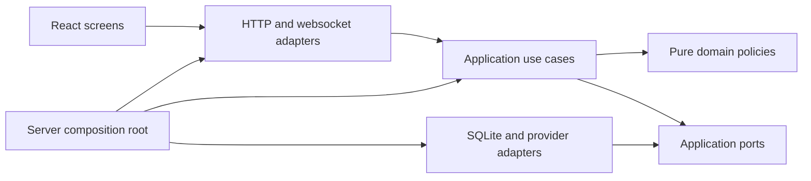

# Architecture and reconstruction contract

This is the implementation target for rebuilding the existing product. It is not
a claim that all boundaries below already exist. The accepted behavior is owned
by [behavior](../specifications/behavior.md), [participation](../specifications/participation.md)
and [personas](../specifications/personas.md). The [dashboard contract](../specifications/dashboard.md)
defines the replacement UI. The microphone-only mode is outside this rewrite.

## Scope and precedence

Preserve the working live flows: configured screen and speech, selected platform
chat, fixed participation notices, individual consent and withdrawal, automatic
six-person cast, inference and review, reader/OBS overlay, account connections,
usage limits, broadcast recovery and rights handling. Existing code is evidence
of protocol behavior, not the architecture to preserve. A defect or obsolete
manual-authoring experiment does not become a requirement because it has a test.

The latest accepted changes override older private source documents: broadcast
state survives process restart; broadcast end destroys it; consent uses one
short confirmed notice and one fresh command; recently observed viewers can
share delivery; broadcast accounts are excluded; configured video/audio need no
privacy enable flags; forced-reply and broadcaster test modes are removed.

Keep Node, TypeScript, Fastify, React, Vite, SQLite and existing provider SDKs.
Do not introduce a service framework, message broker, dependency injection
container, generic repository hierarchy or a second production runtime. Prefer
small named functions and explicit constructor dependencies.

## Dependencies and ownership

| Location                   | Responsibility                                                                                        | Must not own                                                                    |
| -------------------------- | ----------------------------------------------------------------------------------------------------- | ------------------------------------------------------------------------------- |
| `packages/domain/`         | Pure broadcast, participation, evidence and reaction policies; explicit values and outcomes           | HTTP, SQL, provider clients, timers, environment reads                          |
| `packages/application/`    | Use cases, lifecycle coordination, cancellation, ports and application projections                    | Fastify/React objects, provider JSON, ad-hoc SQL                                |
| `packages/infrastructure/` | SQLite repositories/migrations, credential storage, platform and inference adapters, worker processes | UI decisions, independent consent decisions, broadcast lifetime policy          |
| `packages/contracts/`      | Validated HTTP/websocket/configuration DTOs used at boundaries                                        | Service instances or secrets in public DTOs                                     |
| `apps/server/`             | Composition, HTTP security, route registration, websocket delivery and process lifecycle              | Participation rules, AI selection logic or database queries in route handlers   |
| `apps/web/src/`            | Typed API client, session hooks, feature screens and reusable presentation components                 | Provider tokens in browser storage, server policy decisions, raw state mutation |
| `workers/`                 | Bounded audio/video and incompatible SDK process isolation                                            | Broadcast state or permission decisions                                         |

Flat legacy modules may remain during replacement. A temporary adapter can connect
a new use case to an old module while its replacement is under test. Final
completion requires removing superseded runtime paths, not leaving a permanent
facade over the same monolith. Each file should have one reason to change; split
by responsibility, not by an arbitrary line-count target.

## Application services

| Owner               | Public operations                                                                            | Durable responsibility                                                            |
| ------------------- | -------------------------------------------------------------------------------------------- | --------------------------------------------------------------------------------- |
| Broadcast lifecycle | Start inputs, enable/disable AI, close/new broadcast, disclose, reset data, shutdown/recover | Session identity, closed marker, desired AI state                                 |
| Participation       | Classify commands, record delivery, accept fresh consent, block age, withdraw                | Participant state, consent epoch/version, delivery opportunity, replay protection |
| Notice delivery     | Choose pending room guidance, reserve rate budget, send, confirm/reject result               | Confirmed delivery and rate reservations; no arbitrary text send capability       |
| Conversation        | Admit permitted messages, edit/hide, project public state, collect model context             | Chat, opaque speaker identities and publication dependencies                      |
| AI reactions        | Select fresh context and persona, generate, review, optionally approve, publish              | Usage reservations, attempt state, bounded sanitized diagnostics                  |
| Cast                | Compose/reuse six synthetic viewers, select eligible members, record presence/speech         | Definitions and broadcast cast; no real-viewer profiling                          |
| Inputs              | Manage configured screen, speech and selected platform adapters                              | Checkpoints and transcription usage; raw media is transient                       |
| Accounts            | Authorize/select/forget supported accounts and model                                         | Encrypted credentials, separate from broadcast records                            |
| Rights              | Intake, minimal follow-up, outcomes and deletion                                             | Separate rights database, retained beyond broadcast end as required               |
| Status              | Project actual readiness, desired versus effective execution, scoped API errors              | No independently mutable copy of runtime state                                    |

Ports describe only operations their consumer uses. Repository adapters implement
explicit queries and transactions, not generic `get/set<any>` bags. HTTP handlers
validate requests, call one use case and map its outcome. Cross-service workflows
belong in application code, not route callbacks or implicit EventEmitter chains.

## Broadcast and execution lifecycle

Broadcast state and process state are distinct. The broadcast is `open` or
`closed`. AI has durable enabled/disabled intent and transient running/waiting/error
state. Restart does not create a new broadcast or imply withdrawal. Inputs have
independent configured, starting, receiving, unavailable and stopped states.

| Trigger                                 | Required transition                                                                                                 |
| --------------------------------------- | ------------------------------------------------------------------------------------------------------------------- |
| Enable AI                               | Validate readiness, start needed configured inputs, reuse/create the cast and enable generation                     |
| Disable AI                              | Persist disabled intent and cancel generation/review/publication; input collection remains independently controlled |
| Stop all inputs                         | Disable AI, cancel pending work and stop every input adapter                                                        |
| Process shutdown                        | Stop transient work, preserve intent/session, close resources; do not end the broadcast                             |
| Process startup                         | Load the same session, cancel incomplete attempts and recover enabled AI after required inputs/model are ready      |
| Input temporarily unavailable           | Show the cause; never fabricate healthy input or declare broadcast end                                              |
| Explicit or authoritative broadcast end | Disable AI, invalidate pending work, stop inputs, atomically erase broadcast data and retain a closed marker        |
| New broadcast                           | Finish the previous session, create a new identity with AI disabled and fresh participation/cast state              |
| Disclosure                              | Stop AI and make origin labels irreversible for this broadcast; retain actual displayed names                       |

Concurrent lifecycle commands must have a defined order. Stop/cancel takes effect
before awaiting an adapter shutdown. No delayed start, model result or notice
acknowledgement can reopen a closed broadcast. Shutdown and end must be separately
testable operations, with resources closed exactly once.

The [platform task owner](../../packages/application/inputs/platform-tasks.ts)
registers each adapter before invoking it and permits one task per platform.
Cancellation holds that platform's slot through request draining and stopped-state
notification. Whole-input shutdown blocks new platform starts until all adapters
and the final state projection finish. Concurrent stops share their drain; abort
listeners cannot reenter an unregistered stop, and synchronous adapter failures
release their slots just like rejected requests. Late failures after cancellation
do not overwrite the stopped state.

Individual screen, speech and chat controls use the same broadcast command owner
as whole-pipeline controls. They cannot start during a closed broadcast, process
shutdown or an adapter shutdown still draining. Individual and whole-pipeline
stops share pending adapter work; an individual stop supersedes a delayed new
broadcast command. Stopping screen input disables AI and disarms the cast;
stopping speech or chat preserves independent AI intent. The
[input HTTP routes](../../apps/server/http/routes/inputs.ts) only map commands and
serve the configured preview/transcript queries; they do not own lifecycle rules.

The [profile update use case](../../packages/application/participation/profile-update.ts)
validates the submitted profile before effects, preserves the rights-database
restart requirement and requires a new notice version for processing changes.
It installs through the broadcast coordinator's configuration command rather
than stopping adapters independently in an HTTP handler. The coordinator
disables generation and disarms the cast, drains all inputs, and holds a start
barrier through synchronous installation. A newer stop/end/configuration command
or shutdown supersedes an older pending installation. Teardown failure does not
install a new profile; speech erasure must succeed before consent/profile
replacement. The [profile HTTP route](../../apps/server/http/routes/profile.ts)
only delegates the submitted body. Configuration updates do not restart inputs
or resume AI automatically.

## Ingestion, consent and withdrawal

1. Normalize the external event at the adapter boundary; retain original event
   ordering when available and never invent a provider timestamp.
2. Exclude the broadcast account and configured bots. Classify exact commands
   before any public storage or model context admission.
3. Store only minimal state for a nonparticipant. Never retain their ordinary
   message body in the database, diagnostics, browser state or summaries.
4. Send one fixed notice with its public URL. Confirm actual delivery using the
   provider's supported acknowledgement; unconfirmed sending is not delivery.
5. Share that delivery with the target and waiting viewers observed in the same
   room within five minutes. Unknown later arrivals are not assumed present.
6. Require each viewer's fresh command after delivery. Preserve ordering, notice
   version, account, platform, broadcaster and broadcast identity boundaries.
7. Admit only messages after that viewer's current consent generation.

The [consent policy](../../packages/domain/participation/consent.ts) is a pure
state transition over explicit time, profile availability and observation identity.
It returns the next participant, permission result and invalidation revision;
it performs no persistence, identifier generation or callbacks. The [participation service](../../packages/application/participation/service.ts)
applies these transitions with injected time, identifiers and profile fingerprints.
It owns command, delivery and profile operations; a bound persistence port commits
the resulting consent state and dependent chat removal together. The [guidance policy](../../packages/domain/participation/notices.ts) separately
decides rate reservations and room-scoped delivery opportunities without treating
either as consent. It rejects another reservation for an already-covered viewer.
The [CHZZK connection adapter](../../packages/infrastructure/platforms/chzzk-connection.ts)
owns session authorization, worker subscription, reconnect backoff and cleanup.
The supervisor supplies account, admission, notice and status ports; the adapter
does not access broadcast storage. Each connection retires its callbacks on
abort, worker exit or error, removes listeners and clears its subscription timeout.
Late subscription failures cannot change a replacement connection's state or
admit messages. Repeated connected events issue only one subscription per worker.
Broadcaster messages and messages outside the subscribed room remain excluded.
The [notice delivery session](../../packages/application/participation/notice-delivery-session.ts)
owns the common YouTube/CHZZK one-second polling lifecycle. It permits only one
outstanding tick, cancels polling and resets the sender immediately on abort,
and drains the request before shutdown finishes. Queued callbacks and late
failures cannot restart sending. Unexpected exceptions retire this delivery
session and expose unconfirmed delivery; reconnect the platform to resume.
Expected provider failures retain their existing sender-specific backoff policy.
The [fixed notice delivery owner](../../packages/application/participation/fixed-notice-delivery.ts)
selects eligible waiting viewers, reserves attempts, binds one outstanding notice
to the broadcast/profile/consent revision, and verifies delivery receipts. Time
and identifier generation are injected by composition. Sending and receipt use
the same eligibility check; a target already covered by another confirmed notice
cannot turn a late receipt into delivery for newer viewers. Invalidated jobs
release the queue without waiting for their expiry. Reset discards receipts but
does not refund the process-level attempt budget. Only exact authenticated
broadcaster echoes confirm SOOP notices; individual consent remains separate.
The [YouTube notice transport](../../packages/infrastructure/platforms/youtube-notice-transport.ts)
owns token access, the fixed insertion request and typed receipt/error decoding.
It rechecks account and application eligibility after token refresh and after
reading response bodies. Reconnecting receipt input pauses new writes but does
not invalidate a successful insertion with the exact chat, broadcaster and text.
Invalidated requests cannot overwrite current status with late provider errors.
Failures identify `liveChatMessages.insert` as a send operation and preserve its
existing retry delay; provider bodies never become diagnostics.
The [CHZZK notice transport](../../packages/infrastructure/platforms/chzzk-notice-transport.ts)
owns account identity lookup and insertion with typed identity/receipt validation.
It binds requests to refreshed credentials and checks cancellation and application
eligibility after each response. Its result retains a validity check for the
application continuation, so replaced credentials or reset targets cannot apply
an obsolete success or error. Identity lookup and insertion keep separate API
failure attribution and their existing retry delays. No provider body is exposed
as an operator diagnostic. The [single-notice formatter](../../packages/domain/participation/notice-text.ts)
normalizes whitespace and rejects oversized complete notices. Senders hold one
message rather than a fragment array or progress index; the visible prefix has no
multipart counter. Existing conservative body budgets remain 170 UTF-16 code
units for YouTube and 88 for CHZZK. URLs and required text are never truncated.
YouTube can reserve another attempt after pausing before insertion, while
confirmed delivery completes the job immediately.

The [notice sender application service](../../packages/application/participation/notice-sender.ts)
owns pending jobs, single-flight execution, account readiness, delivery confirmation
and provider retry deadlines for both platforms. It depends on a small
[transport port](../../packages/application/participation/notice-transport.ts), not
HTTP clients or credential classes. It revalidates ownership before applying
transport results and ignores late exceptions after reset. The
[infrastructure composition](../../packages/infrastructure/participation/platform-notices.ts)
provides transport, clock and identifiers; the old flat notice modules only
re-export these constructors for reference callers. Remaining provider receive
loops still require reconstruction.

The [YouTube chat payload adapter](../../packages/infrastructure/platforms/youtube-chat-payload.ts)
normalizes REST and gRPC messages through the shared incoming-message contract.
Unusable individual messages are skipped; missing author identity is never
replaced with a fabricated viewer account. Provider timestamps remain unknown
when missing or invalid. Page cursors, offline timestamps and polling intervals
are validated before ingestion/checkpoint updates; malformed envelopes cannot
advance the cursor or end the broadcast. Both transports share own-channel
exclusion and broadcaster mapping. Discovery responses received after cancellation
do not resolve a channel or reopen receiver state.

The [YouTube gRPC adapter](../../packages/infrastructure/platforms/youtube-grpc.ts)
owns one authenticated stream and its client. It creates no client until token
refresh completes and cancellation is rechecked. Stream setup errors, consumer
errors, upstream failures, early broadcast end and normal completion all release
the client. Abort immediately cancels the stream and closes the client; queued
batches are ignored and cleanup is idempotent. Upstream error codes remain intact
for the receiver's quota and fallback decisions. Tests inject a stream client and
never connect to the actual provider.

Profile validation is
an application policy; the process adapter supplies cryptographic fingerprints
without importing Node APIs into the application layer.

Withdrawal must commit consent invalidation and local raw/dependent deletion in
one storage transaction, then invalidate running work and refresh all projections.
The [SQLite transaction owner](../../packages/infrastructure/storage/transactions.ts)
joins nested synchronous mutations. Before the outer transaction it checkpoints
session identity, participant references, observations, profile and notice budget.
A work or commit failure restores those in-memory values as well as rolling back
SQL; even a swallowed nested failure prevents commit. Withdrawal callbacks and
public removal notifications run after successful commit, so failed writes cannot
create follow-up work or publish an uncommitted removal. Notification failures do
not roll back committed data or prevent the remaining queued notifications.

The [snapshot adapter](../../packages/infrastructure/participation/snapshots.ts)
retains the existing broadcast-database record. Restoring a process still drops
unconfirmed manual observations; rolling back a transaction preserves them.
The [conversation context service](../../packages/application/conversation/context-service.ts)
owns removal, summary reset and retention behind the participation persistence
port. Its [SQLite adapter](../../packages/infrastructure/conversation/context-sqlite.ts)
owns context queries, event writes and attempt cleanup. A
[pure dependency traversal](../../packages/domain/conversation/dependencies.ts)
includes transitive replies/provenance and terminates on cycles. The legacy
conversation store composes these services; its ingestion, persistence lifecycle
and persona-storage SQL still require replacement.

The [summary policy](../../packages/domain/conversation/summary.ts) classifies
recent permitted human messages into fixed labels with a three-account threshold
per label. Retaining an earlier approved summary revalidates its categories and
drops arbitrary stored fields or text. Live approved categories survive withdrawal
until broadcast end or explicit summary reset. The synthetic legacy consent path
retains its rolling-window behavior. Summary reset commits its sequence cutoff
and audit together before invalidating model work. Message, provenance and
identity cleanup are scoped to the current broadcast.

External-request authorization is rechecked after asynchronous preparation and
immediately before transmission. Late provider results must pass the same current
permission checks before publication. Only previously approved coarse anonymous
categories can survive withdrawal; they expire at broadcast end.

## AI pipeline

Separate input selection, pacing/eligibility, persona selection, model request,
review and publication. Use injected time/randomness at policy boundaries so tests
do not depend on sleeps or probability. Context includes the latest ten recent
transcript chunks, eligible human text and configured visual evidence. New input
and background context are distinct; input received during pacing remains eligible.

The provider port supports API-key authentication and Sign in with ChatGPT using
the Responses API. Preserve working authentication, token-counting, streaming,
storage settings and bounded concurrency. Do not replace tested wire protocols
with assumptions. A provider cannot silently switch account or authentication.

The [evidence policy](../../packages/domain/reactions/evidence.ts) selects the
current chat window and latest ten transcript chunks by capture time, separates
new triggers from background, and prunes consumed-input bookkeeping without
consuming new evidence. Synthetic chat alone is not a speech-trigger substitute.
Message revisions include both speaker and text; the scheduler hashes that
revision into its duplicate key so edits to the same platform message remain
eligible without retaining raw text in the key.

The [cast selection policy](../../packages/domain/reactions/cast-selection.ts)
owns presence boundaries, observation age, global and per-member pacing,
activity-band caps, topic/mention weighting and probabilistic silence. It receives
time and random draws explicitly and performs no storage, network or timer work.
Zero propensity always stays silent. Observation age includes configured pacing
and model delay but never exceeds the context window. The legacy scheduler still
coordinates timers, provider requests, review and publication during replacement.

Every attempt carries broadcast/context/consent and cast revisions. Review and
publication validate those revisions, cited evidence, expiry, duplicate and
frequency rules. Silence is a normal result. Failures distinguish authentication,
quota, local budget, token bounds, timeouts and invalid output. Diagnostics contain
fixed categories/counts/IDs, never raw input, drafts or credential payloads.

The [decision contract](../../packages/contracts/decision.ts) owns the model-output
shape. The [application validator](../../packages/application/reactions/validate-decision.ts)
parses that shape and applies the
[pure evidence/output policy](../../packages/domain/reactions/decision.ts).
[Review and publication policies](../../packages/domain/reactions/publication.ts)
drop expired background speech while rejecting expired cited speech; bind a
candidate to its broadcast, generation, consent revision and deadline; and require
all input message bodies to match their current permitted versions. An edited
message is stale evidence even if its identifier still exists. The scheduler
gathers current evidence through its adapters and applies the same checks after
review and before publication. Invalid candidates are discarded before another
publication-delay timer is scheduled. Rejection diagnostics contain fixed reasons,
not input text.

The [model authorization service](../../packages/application/reactions/model-authorization.ts)
revalidates the exact outgoing message text, frame bytes/capture time and both
background/new transcript windows at each provider boundary. Current consent
revision, profile availability and an open broadcast are required even for
text-only or empty contexts. An edited message with the same ID is stale input.
The [audience query](../../packages/infrastructure/reactions/model-audience.ts)
loads message authors in one broadcast-scoped query and matches platform/account/
channel identities. Only participant IDs and authorized epochs are retained for
late provider request tracking, never mutable participant objects or raw chat.
The [runtime adapter](../../packages/infrastructure/reactions/model-authorization.ts)
connects these ports to current media, consent, storage and rights follow-up owners.

The [draft and review use case](../../packages/application/reactions/draft-review.ts)
owns the bounded generation workflow: an initial response, at most one requested
frame inspection, and optional independent review. It receives provider, current
input and cancellation ports rather than storage or timer objects. Every awaited
response is checked against the current execution before another request or a
candidate can be returned. Review excludes expired background speech and rejects
expired cited speech. Unavailable or repeated inspection ends the cast attempt as
skipped instead of leaving it generating. The scheduler owns pacing and candidate
publication; it does not duplicate the draft/review sequence.

The [metered model-call use case](../../packages/application/reactions/model-call.ts)
owns pre-request budget reservation, bounded diagnostic metadata and post-response
usage settlement. The [SQLite usage adapter](../../packages/infrastructure/reactions/usage-sqlite.ts)
atomically reserves call and monetary capacity within the current broadcast.
Already-aborted requests consume no capacity. Ambiguous provider failures retain
the reservation; missing or invalid token counts cannot reduce its monetary bound.
Sign in with ChatGPT records token usage without applying Responses API monetary
rates. Late settlement is scoped to the broadcast that is still current. Provider
transport and scheduling remain separate reconstruction work.

The [local publication service](../../packages/application/reactions/publication-service.ts)
commits the response, full source-message provenance and cast attempt outcome in
one transaction through its [SQLite adapter](../../packages/infrastructure/conversation/publication-sqlite.ts).
Both cast and fallback generation use this path. Missing, hidden or foreign
source messages and closed broadcasts reject publication. Reader notification
runs after commit; notification failure does not turn a durable publication into
a failed attempt that could be retried. Reconnect snapshots recover committed
messages. A provenance write failure rolls back publication before any notification.

The [automatic cast service](../../packages/application/cast/automatic.ts) reuses
the current broadcast cast or composes exactly six distinct synthetic identities.
It validates the [definition contract](../../packages/contracts/persona-definition.ts)
and resolves normalized display-name collisions without modifying composition
seeds. The [SQLite adapter](../../packages/infrastructure/cast/automatic-sqlite.ts)
commits approved definitions, present members, initial presence intervals and
system provenance together. This path does not invoke manual candidate creation,
operator review, audition or cast approval. A storage failure leaves no partial
cast. The legacy persona facade delegates automatic preparation and summary to
these owners; legacy authoring and cast-control methods still require cleanup.

The [cast execution control](../../packages/application/cast/control.ts) owns
arming and stopping independently of authoring. Its
[SQLite adapter](../../packages/infrastructure/cast/control-sqlite.ts) scopes
commands to the current broadcast. A stop commits the disabled flag, execution
epoch advance, cancellation of unfinished attempts and audit record together.
Arming checks the current epoch and an open broadcast, and commits its audit in
the same transaction. Failure cannot leave a half-applied control transition;
re-arming never revives canceled attempts.

Live server composition now instantiates only the
[broadcast cast API](../../packages/application/cast/broadcast-cast.ts) through
its [runtime factory](../../packages/infrastructure/cast/runtime.ts). AI startup
prepares/reuses the cast and arms its current execution; status and shutdown use
the same owners. It does not seed authoring templates, construct audition clients
or install authoring idempotency hooks. The legacy endpoints and their persistence
hooks are isolated in [demo routes](../../apps/server/demo/persona-routes.ts),
loaded only for synthetic demo operation. They remain reference functionality,
not part of the live product's architecture or UI.

The [speech transcription use case](../../packages/application/inputs/transcribe-speech.ts)
owns durable request reservation, current-context checks, text normalization and
publication outcomes. The [Groq adapter](../../packages/infrastructure/inputs/groq-speech.ts)
owns WAV encoding, multipart request fields and provider response/error parsing.
The existing worker coordinator supplies cancellation, clocks and publication
callbacks. Failed request-count persistence sends no audio and conservatively retains
the attempted count because a throwing callback may already have committed. Late results and failures after context reset
cannot publish speech or overwrite the current input state. Recent-window
selection and the AI pipeline's latest-ten-chunk contract remain unchanged.

The [input worker session](../../packages/infrastructure/inputs/worker-session.ts)
owns the child process, restricted environment, IPC listeners and reconnect timer
for both capture and speech. Stop releases callbacks before sending the stop
command and killing the child. Released generations and superseded retry
callbacks cannot mutate current state or restart inputs. Natural exit releases
the handle before notifying the coordinator. Capture and speech still own their
distinct backoff, input validation and recent-window policies; this process
adapter does not decide broadcast lifetime. Speech budget exhaustion stops the
worker without scheduling another reconnect.

The [screen context](../../packages/application/inputs/screen-context.ts) owns
frame evidence independently of processes and image encoding: ten retained
frames within thirty seconds, three preview candidates within ten seconds,
source-resolution invalidation and the context-clear timestamp barrier. The
capture adapter supplies IDs, hashing and a clock. Restarting an input cannot
erase the context-clear barrier and admit an older in-flight sample.
[Worker event contracts](../../packages/contracts/input-events.ts) and their
[decoder](../../packages/infrastructure/inputs/worker-events.ts) validate
timestamps, dimensions, bounded canonical base64 and exact configured PCM chunk
length before events reach the input coordinators. Speech context selection
continues to use the latest ten eligible chunks.

The [reaction attempt port](../../packages/application/reactions/attempts.ts)
separates scheduling from durable context reservation and outcome recording.
Its [SQLite adapter](../../packages/infrastructure/reactions/attempts-sqlite.ts)
inserts only when the current broadcast is open and the live, armed cast and
present, unmuted member still match the captured epochs, definition hash and
configuration revision. The eligibility check and insertion are one SQL statement;
duplicate member/context reservations remain idempotent. Candidate promotion
rechecks those bindings and only advances a generating attempt. Terminal
attempts cannot be revived, dispatching cannot regress to candidate, and outcome
updates cannot cross the current broadcast boundary. Atomic public message
publication remains the separate publication repository's responsibility.

The [cast runtime query](../../packages/infrastructure/cast/runtime-query.ts)
loads the current open broadcast's active cast in five queries regardless of
member count. Last visible speech, the leading consecutive speaker and ordered
presence intervals are computed from batched reads. Muted and absent members
are excluded. The [runtime contract](../../packages/contracts/cast-runtime.ts)
validates definition snapshots, presence and the shared
[cast configuration](../../packages/contracts/cast-configuration.ts) before
the scheduler receives them. Invalid persisted definitions or policies fail
the read rather than entering model context. Legacy authoring imports re-export
the same configuration schemas; they do not own a second definition of them.

The [cast dispatch port](../../packages/application/reactions/dispatch.ts)
claims a candidate immediately before local publication. Its
[SQLite adapter](../../packages/infrastructure/reactions/dispatch-sqlite.ts)
rechecks the candidate's cast/member ownership, current broadcast, epochs,
definition hash and configuration revision inside the same transaction as the
candidate-to-dispatching transition. Input references are checked together
against visible messages and persisted speech in that broadcast.
The [pure dispatch policy](../../packages/domain/reactions/dispatch.ts) evaluates
reserved plus published activity, global/member cooldowns, inflight and
consecutive limits, and normalized long-text duplication. Invalid records or a
failed write leave the candidate unclaimed; a second claim cannot succeed.

Provider HTTP composition belongs to the
[Responses API adapter](../../packages/infrastructure/reactions/responses-api.ts)
and the [Sign in with ChatGPT model adapter](../../packages/infrastructure/reactions/chatgpt-model.ts).
Both implement the application model port. The API adapter accepts an injected
transport for fixture verification; the subscription adapter only depends on
current account/model identity and token access, not the account storage class.
Input authorization and request-ID recording remain at every outgoing request
boundary. Shared [response payload validation](../../packages/infrastructure/reactions/response-payload.ts)
rejects negative/non-numeric token counts and malformed output text before usage
accounting. The old model module only re-exports compatibility entry points.

The [Responses API stream decoder](../../packages/infrastructure/reactions/responses-stream.ts)
handles SSE framing, chunked UTF-8 text, completion validation and optional usage
counts separately from authentication, HTTP requests and decision validation.
It requires a completed response, rejects invalid/oversized text and bounds the
stream to 1 MiB. Parse failures and caller cancellation cancel the reader before
releasing its lock; cancellation also wakes an idle stream read. Its event types
follow the [official streaming guide](https://developers.openai.com/api/docs/guides/streaming-responses).

The [outgoing context projection](../../packages/application/reactions/model-context.ts)
selects message IDs, pseudonymous speakers, text, transcript timestamps and frame
references explicitly. Extra fields attached to internal objects never enter the
model payload. Anonymous summaries are restricted to approved topic/mood labels.
The [message renderer](../../packages/infrastructure/reactions/model-messages.ts)
loads the answer/review prompts and encodes the selected frame bytes for the wire
format. Application context projection does not read files or depend on a provider
client, and image encoding handles Uint8Array views without exposing adjacent bytes.

The [model port](../../packages/application/reactions/model-port.ts) defines
provider-independent generation input and result types. Image bytes are generic
Uint8Array data; the Node composition retains Buffer compatibility without
requiring capture workers or HTTP clients in that interface. The
[model concurrency limiter](../../packages/application/reactions/model-concurrency.ts)
owns FIFO admission, canceled waiter removal and exactly-once slot release.
Invalid limits fail immediately rather than leaving requests queued forever;
queued cancellations never invoke a provider. Active calls retain their slots
until they settle, even if their caller has requested cancellation.

The [generation recovery policy](../../packages/application/reactions/recovery.ts)
owns retry decisions and the operator-facing issue state. Three consecutive
transient request failures stop AI; a successful response or a non-transient
validation/stale-context outcome breaks that streak. Permanent errors and budget
exhaustion stop immediately. Provider error classification supplies a typed issue,
while the scheduler applies the returned stop state only for its current generation.

The optional [timing gate use case](../../packages/application/reactions/timing-gate.ts)
owns its separate request cap, probability threshold and evaluation status.
Its [TypeSafe adapter](../../packages/infrastructure/reactions/typesafe-gate.ts)
owns prompt loading, credentials, the text-only HTTP payload, bounded response
validation and timeout. Each evaluation snapshots its configuration and has a
revision; a superseded response cannot overwrite the newest status or allow a
canceled generation. Every outgoing evaluation still counts toward the cap.

The [generation work owner](../../packages/application/reactions/generation-work.ts)
tracks the current asynchronous request with an identity-bound lease. Cancellation
advances the generation, detaches the busy slot, clears retained chat context
from every draft/review input variant and aborts the request. A replacement can
start even if an old transport ignores cancellation. Late completion or input
callbacks cannot clear the new busy slot, restore canceled context or change its
pacing. The scheduler also ignores errors escaping an obsolete generation.

The [reaction schedule](../../packages/application/reactions/scheduling.ts)
owns polling and delayed-publication timers through an injected clock. Canceling,
restarting or replacing a timer invalidates callbacks already queued by the host;
an old callback cannot execute or clear its replacement. Publication callbacks
are one-shot even when invoked again. A synchronous polling or publication error
stops both timers before reaching the scheduler's error handler. Delayed storage
failures therefore stop AI with a diagnostic instead of escaping the timer and
terminating the process. Manual publication also cancels its queued callback.

## Persistence and external effects

The [conversation identity service](../../packages/application/conversation/identity-service.ts)
owns origin disclosure and collision refresh. Its
[SQLite repository](../../packages/infrastructure/conversation/identity-sqlite.ts)
projects only visible, current-broadcast actor IDs, display names and origin
kinds. Full disclosure disables durable AI intent and writes the disclosure event
in one transaction; reference cast disclosure selects only that cast's synthetic
actors. Collision normalization is a pure domain rule. Readers receive the event
and reset only after commit, and transaction rollback restores the collision cache
along with persisted intent. Private account identifiers are never disclosure fields.

The [incoming message contract](../../packages/contracts/incoming.ts) validates
platform input before persistence. The
[incoming SQLite writer](../../packages/infrastructure/conversation/incoming-sqlite.ts)
accepts only admitted messages and owns source deduplication, immutable author
binding, actor creation, edits, message events and connector checkpoints. It runs
inside the ingestion transaction; summary updates share that transaction and
reader notifications wait for its outermost commit. Failed batches leave no
messages, actor records, summary or advanced cursor. A closed broadcast admits
neither content nor post-ingestion summary writes. The [ingestion use case](../../packages/application/conversation/ingestion.ts)
owns validation, admission, persistence, summary refresh and post-commit effects.
Live admission delegates exclusively to ParticipationService; local demo consent
and notice claims belong to the
[reference adapter](../../packages/infrastructure/participation/reference-admission.ts).
Reference notice claims share the ingestion transaction, so rollback never leaves
a failed batch marked as announced. Platform input adapters call the use case
directly; Store only composes its dependencies and retains compatibility methods.

[Broadcast retention](../../packages/application/broadcast/retention.ts) keeps
active live-broadcast history regardless of its age. For eligible historical
records, its [SQLite repository](../../packages/infrastructure/storage/retention-sqlite.ts)
removes expired content, related cast records and orphaned identities in one
transaction. It preserves the current session row, including a closed marker,
so cleanup cannot implicitly reopen a broadcast on restart. Identity disclosure
payloads lose deleted actors without removing fresh disclosures. Only committed
changes trigger compaction and reader reset; no-op cleanup emits neither.

[Database initialization](../../packages/infrastructure/storage/initialize.ts)
sets connection pragmas and rejects schemas newer than this application supports
before writing broadcast records. The
[schema owner](../../packages/infrastructure/storage/schema.ts) creates and
upgrades tables; the
[restart recovery owner](../../packages/infrastructure/storage/recovery.ts)
invalidates unfinished reactions, advances live cast epochs and selects the
latest broadcast, including its closed marker. Schema changes, recovery and the
schema version commit in one transaction. Failure restores the prior database;
startup closes its connection instead of exposing a partially initialized Store.
Recovery preserves chat, participation, transcripts and durable AI intent.

The [broadcast lifetime service](../../packages/application/broadcast/lifetime.ts)
owns end, replacement and explicit erasure. Its
[SQLite repository](../../packages/infrastructure/broadcast/lifetime-sqlite.ts)
owns the disposable record set and post-commit database compaction. A live
broadcast replacement erases the prior data, creates one new session and updates
the in-memory participation state in a single transaction. A failed write restores
both SQL and memory; readers receive a reset only after commit. Ending an already
closed broadcast is idempotent. Independent rights follow-ups and account tokens
survive these transitions. The reference/demo path retains historical records on
end, but its close and next-session creation share the same transaction boundary.

One private SQLite broadcast database owns session-scoped records; a separate
rights database and encrypted account files have independent lifetimes. Keep the
current configured database usable through explicit, tested schema migrations.
Do not silently select another file, discard an open broadcast or start a fresh
session to make a migration pass. Runtime DB handles remain inside adapters.

Durable writes precede externally visible publication or acknowledgement. Provider
writes remain at-least-once where remote acknowledgement is ambiguous; do not
claim exactly-once delivery. Confirmed notices and usage survive restart. On end,
remove chat, consent, summaries, transcripts, cast, pending work and broadcast
budgets atomically, then checkpoint/compact according to the storage adapter.

Raw PCM and frames stay bounded in memory. Browser storage must not contain chat,
transcripts, consent records or credentials. Transcript downloads are explicit
administrator actions and remain outside automatic deletion. Reader projections
never contain administrator-only account, consent or rights data.

The [rights service](../../packages/application/rights/service.ts) owns request
intake, bounded provider-request references, resolution checks and deletion
eligibility. Its [pure policy](../../packages/domain/rights/resolution.ts) checks
completion independently of transport and storage. The
[SQLite adapter](../../packages/infrastructure/rights/sqlite.ts) preserves the
existing separate database format, validates stored records, and performs
read/modify/write operations in transactions. The
[HTTP routes](../../apps/server/http/routes/rights.ts) validate transport inputs
and delegate to the service; they do not access SQL. The shared
[profile contract](../../packages/contracts/privacy-profile.ts) is independent
of profile fingerprinting and runtime participation behavior.

The [withdrawal follow-up coordinator](../../packages/application/rights/withdrawal-followups.ts)
connects committed withdrawal to the independent rights database. Its
[durable queue](../../packages/infrastructure/rights/followup-queue.ts) is written
inside the consent/erasure transaction and contains only intake identifiers and at
most 100 distinct provider request IDs. A queue write failure rolls back that
transaction. Undelivered rights work survives broadcast end and restart; it is
rights-processing data, not retained chat or media. Startup and participation
status queries retry delivery. Successful delivery removes the queue payload.

The rights database commits a minimal receipt with each intake. Retrying after a
crash between intake and queue acknowledgement reuses the same task identifier.
Receipt tombstones contain only opaque IDs and prevent a resolved/deleted task
from being recreated by an old retry. Late provider IDs attach to their matching
consent epoch. Rights-storage failure leaves work pending without reversing
completed local erasure or propagating an unrelated model-request failure.

The [conversation projection service](../../packages/application/conversation/projection-service.ts)
owns public DTO creation, current consent checks, origin disclosure, snapshot
windows and replay projection. Its
[read adapter](../../packages/infrastructure/conversation/projection-sqlite.ts)
loads the latest 300 visible messages in one joined query, in chronological order;
replay remains bounded to 1,001 events. Private account/channel/consent fields
never enter the public DTO. The
[disclosure policy](../../packages/domain/conversation/disclosure.ts) preserves
actual names and changes only origin labels, with the existing synthetic-name
suffix normalization.

Reader event delivery rechecks message visibility and permission rather than
trusting cached payload text. Closed or foreign broadcasts cannot revive cached
messages. Identity payloads are rebuilt for the currently visible permitted
window; removed identities and extra stored fields are excluded. The server's
synchronous snapshot/listener registration remains unchanged.

The [runtime status source](../../packages/infrastructure/status/runtime.ts) gathers
current adapter observations through read-only dependencies. It reads the current
speech window and latest frame once per query and uses one timestamp for frame
age and throughput. Environment access stays in server composition and supplies
credential-presence flags rather than secrets. The application projection validates
the resulting DTO and removes closed-broadcast content. The
[readiness projection](../../packages/application/status/readiness.ts) is shared
by status and AI-start validation, keeping required profile/model availability
separate from visible optional input failures. Legacy input/provider adapters are
still being replaced; this query adapter does not claim to replace their internals.

The [reader session](../../packages/application/conversation/reader-session.ts)
owns authentication lifetime, heartbeat state, bounded output and source
subscriptions through clock/transport ports. It always sends the current snapshot
on authentication and reprojects every event before delivery. Disposal immediately
removes timers and listeners rather than waiting for a peer to finish closing.
The [websocket adapter](../../apps/server/http/reader-stream.ts) owns socket and
JSON framing and tracks both authenticated and waiting connections. Token rotation
and server shutdown close both groups; late authentication cannot reattach them.

The [transcript journal](../../packages/application/inputs/transcript-journal.ts)
owns durable speech validation, closed-broadcast admission and the current
broadcast's two-minute recovery window. Its
[SQLite repository](../../packages/infrastructure/inputs/transcripts-sqlite.ts)
owns insert, recovery and administrative export queries against the existing
table. Recovery selects twelve chunks with insertion order as the timestamp-tie
breaker; AI context subsequently selects the latest ten. The
[transcript contract](../../packages/contracts/transcript.ts) is shared with
transcription publication. Restart restores committed text; broadcast erasure
continues to remove the table's session data within the broadcast transaction.
Diagnostic count/export reflects all stored rows so closed or foreign records
cannot be hidden from deletion verification. Context invalidation clears all
stored speech, preserving the existing erasure boundary.

The [participation administration service](../../packages/application/participation/administration.ts)
owns the administrator projection and participation controls. Status retries
durable rights follow-ups before reporting the pending count, projects only
reviewed participant fields, and includes a notice only while awaiting consent.
Participant-internal replay IDs, provider request IDs and accepted-policy
bookkeeping are not copied into participant rows. Manual notice confirmation cannot bypass automatic delivery on
YouTube, CHZZK or SOOP. Live-command confirmation and age blocking delegate to the
same transactional participation owner used by ingestion. The
[HTTP routes](../../apps/server/http/routes/participation.ts) validate participant
identifiers and explicit confirmation fields; demo mode has no live controls.

## Platform account connections

The [platform account service](../../packages/application/accounts/platform-accounts.ts)
owns live configuration eligibility, authorization completion, disconnect ordering
and SOOP's single pending five-minute approval window. Its explicit ports keep
credentials, provider requests and receiver implementations out of application
code. Disconnect drains only the selected platform before deleting its stored
credentials; another platform's receiver remains running. New authorization for
that account is rejected while disconnect is draining.

The [account HTTP routes](../../apps/server/http/routes/platform-accounts.ts)
validate callback inputs and render fixed UTF-8 responses while preserving existing
administrator endpoints and OAuth callback URLs. Provider details are mapped to
bounded diagnostic messages. SOOP consumes its pending approval before exchange;
a superseding authorization invalidates both the old token write and its late
status update. Existing token adapters still own provider protocol and refresh and remain
candidates for the remaining adapter rewrite.
SOOP browser chat operations and AI provider accounts have separate lifecycles.

The [encrypted token file](../../packages/infrastructure/accounts/encrypted-token-file.ts)
owns credential file I/O for YouTube, CHZZK, SOOP and Sign in with ChatGPT.
It preserves the existing AES-256-GCM envelope and validates each adapter's
stored schema after decryption and before replacement. Missing files mean no
stored account; unreadable, invalid or unauthenticated files fail closed without
overwriting them or exposing plaintext in errors. Replacement uses a unique
exclusive owner-only temporary file, flushes it before rename and removes it on
failure. Provider adapters update in-memory platform tokens only after the write
succeeds. Sign in with ChatGPT retains its independent multi-account state and
sign-out behavior; the shared file mechanism does not own account selection or
revocation.

The [model account service](../../packages/application/accounts/model-account.ts)
owns generation stop and context invalidation when the selected AI account or
model changes. It rejects pending model lists and selections after another
account command supersedes them, and stops generation again after asynchronous
model validation in case an operator restarted it during the query. Successful
account callback persistence always invalidates context, including a later
command arriving before its continuation resumes. Sign-out invalidates pending
selection before the adapter clears local secrets and awaits remote revocation.
Model selection also advances the adapter's authorization generation so an
older token exchange cannot overwrite the selection. The
[HTTP routes](../../apps/server/http/routes/model-account.ts) validate fields
before invoking effects and preserve existing endpoints; protocol and encrypted
account state remain in the adapter.

The [SOOP bridge service](../../packages/application/inputs/soop-bridge.ts)
owns the official browser SDK's server-side session, status, inbound messages
and fixed-notice coordination. Its
[HTTP adapter](../../apps/server/http/routes/soop-bridge.ts) validates browser
payloads without accessing credentials or mutating participation directly.
An awaited credential result is rechecked against the open broadcast, channel
and app configuration before returning it to the browser. Late failures from a
different broadcast cannot overwrite current authorization status. Closed
broadcasts reject status and chat updates and cannot issue notices.
The session response includes the durable broadcast ID. Every browser status,
message and notice request carries that acquired ID; the server rejects a
different ID before any side effect, even if the new broadcast is already open.
Controller callbacks retain their own ID across reconnection, including rejection
of an old pending notice. A failed authorization sends no unscoped status.
The [shared bridge contract](../../packages/contracts/soop-bridge.ts) is consumed
by both HTTP and browser adapters. Existing tabs must reload the updated client
at cutover; missing broadcast scope is rejected.
Broadcaster messages go only to exact notice echo confirmation; viewer messages
enter the normal consent-aware ingestion path. Non-subscribed reports reset
pending notices and delivery opportunity before updating receiver status.

## UI and contracts

Build a new operator workspace, not more sections inside the current page.
Separate the broadcast dashboard, connections/settings, and participation/rights
screens. Keep reader and overlay routes focused on conversation. Use a single
status query owner and mutation client; feature components consume typed DTOs.
The SOOP browser adapter has its own lifecycle hook and cannot be duplicated by
page navigation. Keep server-derived eligibility distinct from presentation labels.

Preserve existing reader links, OAuth callbacks and supported live administrator
operations during cutover. Replace unstable internal DTOs deliberately and update
consumers/tests together. Legacy persona-authoring APIs that are blocked in live
mode are reference material, not a second product to rebuild. Synthetic demo
inputs remain available to exercise the actual application pipeline.

## Reconstruction and acceptance

Implement in functional slices: lifecycle, participation/conversation/storage,
input and account adapters, AI/cast, HTTP/status, then the replacement workspace
and public surfaces. Update ownership documents as each target becomes real.
Avoid two complete production implementations or unrelated speculative features.

| Contract                         | Required executable evidence                                                                                                                              |
| -------------------------------- | --------------------------------------------------------------------------------------------------------------------------------------------------------- |
| Broadcast identity and AI intent | Graceful and abrupt restart, waiting readiness, explicit stop and closed-marker tests                                                                     |
| Consent and shared guidance      | Fresh/stale/replayed commands, multiple rooms/platforms/viewers, delivery failure, late acknowledgement and no duplicate confirmed guidance               |
| Withdrawal and disclosure        | Current and reconnect snapshots, model authorization races, dependent output, age restrictions, retained anonymous categories                             |
| Inputs and accounts              | Synthetic FFmpeg/SDK/provider boundaries, pinned credentials/model, cancellation, reconnect and scoped errors                                             |
| AI and cast                      | Six persistent synthetic personas; ten-chunk context; pacing, silence, review, budgets, expiry and stale-publication rejection                            |
| Storage                          | Active-session migration, transactional end/deletion, private permissions, distinct credential/rights lifetimes                                           |
| UI                               | Desktop/mobile, keyboard controls, empty/loading/stale/error states, one clear AI switch, explicit disclosure, viewer surfaces and no browser persistence |
| Integration                      | Full check, browser checks, clean documentation links, managed-server lifecycle and no unreviewed live side effects                                       |

The existing tests are a starting point. Keep protocol and user-observable
regressions; replace implementation-coupled tests with boundary tests where the
architecture changes. Add dependency checks to prevent SQL in routes and provider
imports in domain code. A green subset or a set of moved files is not completion.
Real platform/account acceptance remains separate from synthetic validation; do
not send rehearsal notices or invoke paid live AI merely to obtain a test result.
