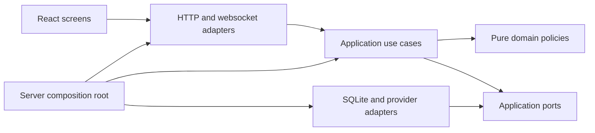

# Architecture and reconstruction contract

This is the implementation target for rebuilding the existing product. It is not
a claim that all boundaries below already exist. The accepted behavior is owned
by [behavior](../specifications/behavior.md), [participation](../specifications/participation.md)
and [personas](../specifications/personas.md). The [dashboard contract](../specifications/dashboard.md)
defines the replacement UI. The microphone-only mode is outside this rewrite.

## Scope and precedence

Preserve the working live flows: configured screen and speech, selected platform
chat, fixed participation notices, individual consent and withdrawal, automatic
six-person cast, inference and review, reader/OBS overlay, account connections,
usage limits, broadcast recovery and rights handling. Existing code is evidence
of protocol behavior, not the architecture to preserve. A defect or obsolete
manual-authoring experiment does not become a requirement because it has a test.

The latest accepted changes override older private source documents: broadcast
state survives process restart; broadcast end destroys it; consent uses one
short confirmed notice and one fresh command; recently observed viewers can
share delivery; broadcast accounts are excluded; configured video/audio need no
privacy enable flags; forced-reply and broadcaster test modes are removed.

Keep Node, TypeScript, Fastify, React, Vite, SQLite and existing provider SDKs.
Do not introduce a service framework, message broker, dependency injection
container, generic repository hierarchy or a second production runtime. Prefer
small named functions and explicit constructor dependencies.

## Dependencies and ownership

| Location                   | Responsibility                                                                                        | Must not own                                                                    |
| -------------------------- | ----------------------------------------------------------------------------------------------------- | ------------------------------------------------------------------------------- |
| `packages/domain/`         | Pure broadcast, participation, evidence and reaction policies; explicit values and outcomes           | HTTP, SQL, provider clients, timers, environment reads                          |
| `packages/application/`    | Use cases, lifecycle coordination, cancellation, ports and application projections                    | Fastify/React objects, provider JSON, ad-hoc SQL                                |
| `packages/infrastructure/` | SQLite repositories/migrations, credential storage, platform and inference adapters, worker processes | UI decisions, independent consent decisions, broadcast lifetime policy          |
| `packages/contracts/`      | Validated HTTP/websocket/configuration DTOs used at boundaries                                        | Service instances or secrets in public DTOs                                     |
| `apps/server/`             | Composition, HTTP security, route registration, websocket delivery and process lifecycle              | Participation rules, AI selection logic or database queries in route handlers   |
| `apps/web/src/`            | Typed API client, session hooks, feature screens and reusable presentation components                 | Provider tokens in browser storage, server policy decisions, raw state mutation |
| `workers/`                 | Bounded audio/video and incompatible SDK process isolation                                            | Broadcast state or permission decisions                                         |

Flat legacy modules may remain during replacement. A temporary adapter can connect
a new use case to an old module while its replacement is under test. Final
completion requires removing superseded runtime paths, not leaving a permanent
facade over the same monolith. Each file should have one reason to change; split
by responsibility, not by an arbitrary line-count target.

## Application services

| Owner               | Public operations                                                                            | Durable responsibility                                                            |
| ------------------- | -------------------------------------------------------------------------------------------- | --------------------------------------------------------------------------------- |
| Broadcast lifecycle | Start inputs, enable/disable AI, close/new broadcast, disclose, reset data, shutdown/recover | Session identity, closed marker, desired AI state                                 |
| Participation       | Classify commands, record delivery, accept fresh consent, block age, withdraw                | Participant state, consent epoch/version, delivery opportunity, replay protection |
| Notice delivery     | Choose pending room guidance, reserve rate budget, send, confirm/reject result               | Confirmed delivery and rate reservations; no arbitrary text send capability       |
| Conversation        | Admit permitted messages, edit/hide, project public state, collect model context             | Chat, opaque speaker identities and publication dependencies                      |
| AI reactions        | Select fresh context and persona, generate, review, optionally approve, publish              | Usage reservations, attempt state, bounded sanitized diagnostics                  |
| Cast                | Compose/reuse six synthetic viewers, select eligible members, record presence/speech         | Definitions and broadcast cast; no real-viewer profiling                          |
| Inputs              | Manage configured screen, speech and selected platform adapters                              | Checkpoints and transcription usage; raw media is transient                       |
| Accounts            | Authorize/select/forget supported accounts and model                                         | Encrypted credentials, separate from broadcast records                            |
| Rights              | Intake, minimal follow-up, outcomes and deletion                                             | Separate rights database, retained beyond broadcast end as required               |
| Status              | Project actual readiness, desired versus effective execution, scoped API errors              | No independently mutable copy of runtime state                                    |

Ports describe only operations their consumer uses. Repository adapters implement
explicit queries and transactions, not generic `get/set<any>` bags. HTTP handlers
validate requests, call one use case and map its outcome. Cross-service workflows
belong in application code, not route callbacks or implicit EventEmitter chains.

## Broadcast and execution lifecycle

Broadcast state and process state are distinct. The broadcast is `open` or
`closed`. AI has durable enabled/disabled intent and transient running/waiting/error
state. Restart does not create a new broadcast or imply withdrawal. Inputs have
independent configured, starting, receiving, unavailable and stopped states.

| Trigger                                 | Required transition                                                                                                 |
| --------------------------------------- | ------------------------------------------------------------------------------------------------------------------- |
| Enable AI                               | Validate readiness, start needed configured inputs, reuse/create the cast and enable generation                     |
| Disable AI                              | Persist disabled intent and cancel generation/review/publication; input collection remains independently controlled |
| Stop all inputs                         | Disable AI, cancel pending work and stop every input adapter                                                        |
| Process shutdown                        | Stop transient work, preserve intent/session, close resources; do not end the broadcast                             |
| Process startup                         | Load the same session, cancel incomplete attempts and recover enabled AI after required inputs/model are ready      |
| Input temporarily unavailable           | Show the cause; never fabricate healthy input or declare broadcast end                                              |
| Explicit or authoritative broadcast end | Disable AI, invalidate pending work, stop inputs, atomically erase broadcast data and retain a closed marker        |
| New broadcast                           | Finish the previous session, create a new identity with AI disabled and fresh participation/cast state              |
| Disclosure                              | Stop AI and make origin labels irreversible for this broadcast; retain actual displayed names                       |

Concurrent lifecycle commands must have a defined order. Stop/cancel takes effect
before awaiting an adapter shutdown. No delayed start, model result or notice
acknowledgement can reopen a closed broadcast. Shutdown and end must be separately
testable operations, with resources closed exactly once.

Individual screen, speech and chat controls use the same broadcast command owner
as whole-pipeline controls. They cannot start during a closed broadcast, process
shutdown or an adapter shutdown still draining. Individual and whole-pipeline
stops share pending adapter work; an individual stop supersedes a delayed new
broadcast command. Stopping screen input disables AI and disarms the cast;
stopping speech or chat preserves independent AI intent. The
[input HTTP routes](../../apps/server/http/routes/inputs.ts) only map commands and
serve the configured preview/transcript queries; they do not own lifecycle rules.

## Ingestion, consent and withdrawal

1. Normalize the external event at the adapter boundary; retain original event
   ordering when available and never invent a provider timestamp.
2. Exclude the broadcast account and configured bots. Classify exact commands
   before any public storage or model context admission.
3. Store only minimal state for a nonparticipant. Never retain their ordinary
   message body in the database, diagnostics, browser state or summaries.
4. Send one fixed notice with its public URL. Confirm actual delivery using the
   provider's supported acknowledgement; unconfirmed sending is not delivery.
5. Share that delivery with the target and waiting viewers observed in the same
   room within five minutes. Unknown later arrivals are not assumed present.
6. Require each viewer's fresh command after delivery. Preserve ordering, notice
   version, account, platform, broadcaster and broadcast identity boundaries.
7. Admit only messages after that viewer's current consent generation.

The [consent policy](../../packages/domain/participation/consent.ts) is a pure
state transition over explicit time, profile availability and observation identity.
It returns the next participant, permission result and invalidation revision;
it performs no persistence, identifier generation or callbacks. The [participation service](../../packages/application/participation/service.ts)
applies these transitions with injected time, identifiers and profile fingerprints.
It owns command, delivery and profile operations; a bound persistence port commits
the resulting consent state and dependent chat removal together. The [guidance policy](../../packages/domain/participation/notices.ts) separately
decides rate reservations and room-scoped delivery opportunities without treating
either as consent. It rejects another reservation for an already-covered viewer.
Provider scheduling remains separate reconstruction work. Profile validation is
an application policy; the process adapter supplies cryptographic fingerprints
without importing Node APIs into the application layer.

Withdrawal must commit consent invalidation and local raw/dependent deletion in
one storage transaction, then invalidate running work and refresh all projections.
The [SQLite transaction owner](../../packages/infrastructure/storage/transactions.ts)
joins nested synchronous mutations. Before the outer transaction it checkpoints
session identity, participant references, observations, profile and notice budget.
A work or commit failure restores those in-memory values as well as rolling back
SQL; even a swallowed nested failure prevents commit. Withdrawal callbacks and
public removal notifications run after successful commit, so failed writes cannot
create follow-up work or publish an uncommitted removal. Notification failures do
not roll back committed data or prevent the remaining queued notifications.

The [snapshot adapter](../../packages/infrastructure/participation/snapshots.ts)
retains the existing broadcast-database record. Restoring a process still drops
unconfirmed manual observations; rolling back a transaction preserves them.
The [conversation context service](../../packages/application/conversation/context-service.ts)
owns removal, summary reset and retention behind the participation persistence
port. Its [SQLite adapter](../../packages/infrastructure/conversation/context-sqlite.ts)
owns context queries, event writes and attempt cleanup. A
[pure dependency traversal](../../packages/domain/conversation/dependencies.ts)
includes transitive replies/provenance and terminates on cycles. The legacy
conversation store composes these services; its ingestion, persistence lifecycle
and persona-storage SQL still require replacement.

The [summary policy](../../packages/domain/conversation/summary.ts) classifies
recent permitted human messages into fixed labels with a three-account threshold
per label. Retaining an earlier approved summary revalidates its categories and
drops arbitrary stored fields or text. Live approved categories survive withdrawal
until broadcast end or explicit summary reset. The synthetic legacy consent path
retains its rolling-window behavior. Summary reset commits its sequence cutoff
and audit together before invalidating model work. Message, provenance and
identity cleanup are scoped to the current broadcast.

External-request authorization is rechecked after asynchronous preparation and
immediately before transmission. Late provider results must pass the same current
permission checks before publication. Only previously approved coarse anonymous
categories can survive withdrawal; they expire at broadcast end.

## AI pipeline

Separate input selection, pacing/eligibility, persona selection, model request,
review and publication. Use injected time/randomness at policy boundaries so tests
do not depend on sleeps or probability. Context includes the latest ten recent
transcript chunks, eligible human text and configured visual evidence. New input
and background context are distinct; input received during pacing remains eligible.

The provider port supports API-key authentication and Sign in with ChatGPT using
the Responses API. Preserve working authentication, token-counting, streaming,
storage settings and bounded concurrency. Do not replace tested wire protocols
with assumptions. A provider cannot silently switch account or authentication.

The [evidence policy](../../packages/domain/reactions/evidence.ts) selects the
current chat window and latest ten transcript chunks by capture time, separates
new triggers from background, and prunes consumed-input bookkeeping without
consuming new evidence. Synthetic chat alone is not a speech-trigger substitute.
Message revisions include both speaker and text; the scheduler hashes that
revision into its duplicate key so edits to the same platform message remain
eligible without retaining raw text in the key.

The [cast selection policy](../../packages/domain/reactions/cast-selection.ts)
owns presence boundaries, observation age, global and per-member pacing,
activity-band caps, topic/mention weighting and probabilistic silence. It receives
time and random draws explicitly and performs no storage, network or timer work.
Zero propensity always stays silent. Observation age includes configured pacing
and model delay but never exceeds the context window. The legacy scheduler still
coordinates timers, provider requests, review and publication during replacement.

Every attempt carries broadcast/context/consent and cast revisions. Review and
publication validate those revisions, cited evidence, expiry, duplicate and
frequency rules. Silence is a normal result. Failures distinguish authentication,
quota, local budget, token bounds, timeouts and invalid output. Diagnostics contain
fixed categories/counts/IDs, never raw input, drafts or credential payloads.

The [decision contract](../../packages/contracts/decision.ts) owns the model-output
shape. The [application validator](../../packages/application/reactions/validate-decision.ts)
parses that shape and applies the
[pure evidence/output policy](../../packages/domain/reactions/decision.ts).
[Review and publication policies](../../packages/domain/reactions/publication.ts)
drop expired background speech while rejecting expired cited speech; bind a
candidate to its broadcast, generation, consent revision and deadline; and require
all input message bodies to match their current permitted versions. An edited
message is stale evidence even if its identifier still exists. The scheduler
gathers current evidence through its adapters and applies the same checks after
review and before publication. Invalid candidates are discarded before another
publication-delay timer is scheduled. Rejection diagnostics contain fixed reasons,
not input text.

The [model authorization service](../../packages/application/reactions/model-authorization.ts)
revalidates the exact outgoing message text, frame bytes/capture time and both
background/new transcript windows at each provider boundary. Current consent
revision, profile availability and an open broadcast are required even for
text-only or empty contexts. An edited message with the same ID is stale input.
The [audience query](../../packages/infrastructure/reactions/model-audience.ts)
loads message authors in one broadcast-scoped query and matches platform/account/
channel identities. Only participant IDs and authorized epochs are retained for
late provider request tracking, never mutable participant objects or raw chat.
The [runtime adapter](../../packages/infrastructure/reactions/model-authorization.ts)
connects these ports to current media, consent, storage and rights follow-up owners.

The [draft and review use case](../../packages/application/reactions/draft-review.ts)
owns the bounded generation workflow: an initial response, at most one requested
frame inspection, and optional independent review. It receives provider, current
input and cancellation ports rather than storage or timer objects. Every awaited
response is checked against the current execution before another request or a
candidate can be returned. Review excludes expired background speech and rejects
expired cited speech. Unavailable or repeated inspection ends the cast attempt as
skipped instead of leaving it generating. The scheduler owns pacing and candidate
publication; it does not duplicate the draft/review sequence.

The [metered model-call use case](../../packages/application/reactions/model-call.ts)
owns pre-request budget reservation, bounded diagnostic metadata and post-response
usage settlement. The [SQLite usage adapter](../../packages/infrastructure/reactions/usage-sqlite.ts)
atomically reserves call and monetary capacity within the current broadcast.
Already-aborted requests consume no capacity. Ambiguous provider failures retain
the reservation; missing or invalid token counts cannot reduce its monetary bound.
Sign in with ChatGPT records token usage without applying Responses API monetary
rates. Late settlement is scoped to the broadcast that is still current. Provider
transport and scheduling remain separate reconstruction work.

The [local publication service](../../packages/application/reactions/publication-service.ts)
commits the response, full source-message provenance and cast attempt outcome in
one transaction through its [SQLite adapter](../../packages/infrastructure/conversation/publication-sqlite.ts).
Both cast and fallback generation use this path. Missing, hidden or foreign
source messages and closed broadcasts reject publication. Reader notification
runs after commit; notification failure does not turn a durable publication into
a failed attempt that could be retried. Reconnect snapshots recover committed
messages. A provenance write failure rolls back publication before any notification.

The [automatic cast service](../../packages/application/cast/automatic.ts) reuses
the current broadcast cast or composes exactly six distinct synthetic identities.
It validates the [definition contract](../../packages/contracts/persona-definition.ts)
and resolves normalized display-name collisions without modifying composition
seeds. The [SQLite adapter](../../packages/infrastructure/cast/automatic-sqlite.ts)
commits approved definitions, present members, initial presence intervals and
system provenance together. This path does not invoke manual candidate creation,
operator review, audition or cast approval. A storage failure leaves no partial
cast. The legacy persona facade delegates automatic preparation and summary to
these owners; legacy authoring and cast-control methods still require cleanup.

The [cast execution control](../../packages/application/cast/control.ts) owns
arming and stopping independently of authoring. Its
[SQLite adapter](../../packages/infrastructure/cast/control-sqlite.ts) scopes
commands to the current broadcast. A stop commits the disabled flag, execution
epoch advance, cancellation of unfinished attempts and audit record together.
Arming checks the current epoch and an open broadcast, and commits its audit in
the same transaction. Failure cannot leave a half-applied control transition;
re-arming never revives canceled attempts.

Live server composition now instantiates only the
[broadcast cast API](../../packages/application/cast/broadcast-cast.ts) through
its [runtime factory](../../packages/infrastructure/cast/runtime.ts). AI startup
prepares/reuses the cast and arms its current execution; status and shutdown use
the same owners. It does not seed authoring templates, construct audition clients
or install authoring idempotency hooks. The legacy endpoints and their persistence
hooks are isolated in [demo routes](../../apps/server/demo/persona-routes.ts),
loaded only for synthetic demo operation. They remain reference functionality,
not part of the live product's architecture or UI.

The [speech transcription use case](../../packages/application/inputs/transcribe-speech.ts)
owns durable request reservation, current-context checks, text normalization and
publication outcomes. The [Groq adapter](../../packages/infrastructure/inputs/groq-speech.ts)
owns WAV encoding, multipart request fields and provider response/error parsing.
The existing worker coordinator supplies cancellation, clocks and publication
callbacks. Failed request-count persistence sends no audio and conservatively retains
the attempted count because a throwing callback may already have committed. Late results and failures after context reset
cannot publish speech or overwrite the current input state. Recent-window
selection and the AI pipeline's latest-ten-chunk contract remain unchanged.

## Persistence and external effects

One private SQLite broadcast database owns session-scoped records; a separate
rights database and encrypted account files have independent lifetimes. Keep the
current configured database usable through explicit, tested schema migrations.
Do not silently select another file, discard an open broadcast or start a fresh
session to make a migration pass. Runtime DB handles remain inside adapters.

Durable writes precede externally visible publication or acknowledgement. Provider
writes remain at-least-once where remote acknowledgement is ambiguous; do not
claim exactly-once delivery. Confirmed notices and usage survive restart. On end,
remove chat, consent, summaries, transcripts, cast, pending work and broadcast
budgets atomically, then checkpoint/compact according to the storage adapter.

Raw PCM and frames stay bounded in memory. Browser storage must not contain chat,
transcripts, consent records or credentials. Transcript downloads are explicit
administrator actions and remain outside automatic deletion. Reader projections
never contain administrator-only account, consent or rights data.

The [rights service](../../packages/application/rights/service.ts) owns request
intake, bounded provider-request references, resolution checks and deletion
eligibility. Its [pure policy](../../packages/domain/rights/resolution.ts) checks
completion independently of transport and storage. The
[SQLite adapter](../../packages/infrastructure/rights/sqlite.ts) preserves the
existing separate database format, validates stored records, and performs
read/modify/write operations in transactions. The
[HTTP routes](../../apps/server/http/routes/rights.ts) validate transport inputs
and delegate to the service; they do not access SQL. The shared
[profile contract](../../packages/contracts/privacy-profile.ts) is independent
of profile fingerprinting and runtime participation behavior.

The [withdrawal follow-up coordinator](../../packages/application/rights/withdrawal-followups.ts)
connects committed withdrawal to the independent rights database. Its
[durable queue](../../packages/infrastructure/rights/followup-queue.ts) is written
inside the consent/erasure transaction and contains only intake identifiers and at
most 100 distinct provider request IDs. A queue write failure rolls back that
transaction. Undelivered rights work survives broadcast end and restart; it is
rights-processing data, not retained chat or media. Startup and participation
status queries retry delivery. Successful delivery removes the queue payload.

The rights database commits a minimal receipt with each intake. Retrying after a
crash between intake and queue acknowledgement reuses the same task identifier.
Receipt tombstones contain only opaque IDs and prevent a resolved/deleted task
from being recreated by an old retry. Late provider IDs attach to their matching
consent epoch. Rights-storage failure leaves work pending without reversing
completed local erasure or propagating an unrelated model-request failure.

The [conversation projection service](../../packages/application/conversation/projection-service.ts)
owns public DTO creation, current consent checks, origin disclosure, snapshot
windows and replay projection. Its
[read adapter](../../packages/infrastructure/conversation/projection-sqlite.ts)
loads the latest 300 visible messages in one joined query, in chronological order;
replay remains bounded to 1,001 events. Private account/channel/consent fields
never enter the public DTO. The
[disclosure policy](../../packages/domain/conversation/disclosure.ts) preserves
actual names and changes only origin labels, with the existing synthetic-name
suffix normalization.

Reader event delivery rechecks message visibility and permission rather than
trusting cached payload text. Closed or foreign broadcasts cannot revive cached
messages. Identity payloads are rebuilt for the currently visible permitted
window; removed identities and extra stored fields are excluded. The server's
synchronous snapshot/listener registration remains unchanged.

The [runtime status source](../../packages/infrastructure/status/runtime.ts) gathers
current adapter observations through read-only dependencies. It reads the current
speech window and latest frame once per query and uses one timestamp for frame
age and throughput. Environment access stays in server composition and supplies
credential-presence flags rather than secrets. The application projection validates
the resulting DTO and removes closed-broadcast content. The
[readiness projection](../../packages/application/status/readiness.ts) is shared
by status and AI-start validation, keeping required profile/model availability
separate from visible optional input failures. Legacy input/provider adapters are
still being replaced; this query adapter does not claim to replace their internals.

The [reader session](../../packages/application/conversation/reader-session.ts)
owns authentication lifetime, heartbeat state, bounded output and source
subscriptions through clock/transport ports. It always sends the current snapshot
on authentication and reprojects every event before delivery. Disposal immediately
removes timers and listeners rather than waiting for a peer to finish closing.
The [websocket adapter](../../apps/server/http/reader-stream.ts) owns socket and
JSON framing and tracks both authenticated and waiting connections. Token rotation
and server shutdown close both groups; late authentication cannot reattach them.

## UI and contracts

Build a new operator workspace, not more sections inside the current page.
Separate the broadcast dashboard, connections/settings, and participation/rights
screens. Keep reader and overlay routes focused on conversation. Use a single
status query owner and mutation client; feature components consume typed DTOs.
The SOOP browser adapter has its own lifecycle hook and cannot be duplicated by
page navigation. Keep server-derived eligibility distinct from presentation labels.

Preserve existing reader links, OAuth callbacks and supported live administrator
operations during cutover. Replace unstable internal DTOs deliberately and update
consumers/tests together. Legacy persona-authoring APIs that are blocked in live
mode are reference material, not a second product to rebuild. Synthetic demo
inputs remain available to exercise the actual application pipeline.

## Reconstruction and acceptance

Implement in functional slices: lifecycle, participation/conversation/storage,
input and account adapters, AI/cast, HTTP/status, then the replacement workspace
and public surfaces. Update ownership documents as each target becomes real.
Avoid two complete production implementations or unrelated speculative features.

| Contract                         | Required executable evidence                                                                                                                              |
| -------------------------------- | --------------------------------------------------------------------------------------------------------------------------------------------------------- |
| Broadcast identity and AI intent | Graceful and abrupt restart, waiting readiness, explicit stop and closed-marker tests                                                                     |
| Consent and shared guidance      | Fresh/stale/replayed commands, multiple rooms/platforms/viewers, delivery failure, late acknowledgement and no duplicate confirmed guidance               |
| Withdrawal and disclosure        | Current and reconnect snapshots, model authorization races, dependent output, age restrictions, retained anonymous categories                             |
| Inputs and accounts              | Synthetic FFmpeg/SDK/provider boundaries, pinned credentials/model, cancellation, reconnect and scoped errors                                             |
| AI and cast                      | Six persistent synthetic personas; ten-chunk context; pacing, silence, review, budgets, expiry and stale-publication rejection                            |
| Storage                          | Active-session migration, transactional end/deletion, private permissions, distinct credential/rights lifetimes                                           |
| UI                               | Desktop/mobile, keyboard controls, empty/loading/stale/error states, one clear AI switch, explicit disclosure, viewer surfaces and no browser persistence |
| Integration                      | Full check, browser checks, clean documentation links, managed-server lifecycle and no unreviewed live side effects                                       |

The existing tests are a starting point. Keep protocol and user-observable
regressions; replace implementation-coupled tests with boundary tests where the
architecture changes. Add dependency checks to prevent SQL in routes and provider
imports in domain code. A green subset or a set of moved files is not completion.
Real platform/account acceptance remains separate from synthetic validation; do
not send rehearsal notices or invoke paid live AI merely to obtain a test result.
