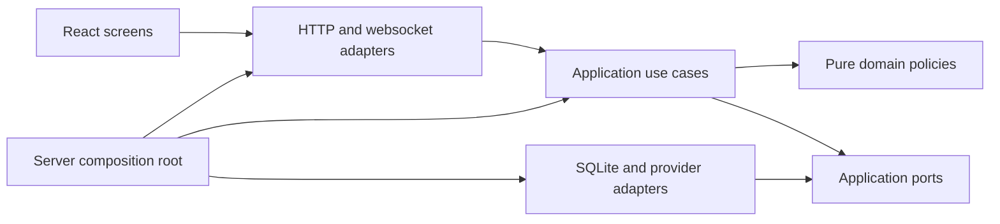

# Architecture and reconstruction contract

This is the implementation target for rebuilding the existing product. It is not
a claim that all boundaries below already exist. The accepted behavior is owned
by [behavior](../specifications/behavior.md), [participation](../specifications/participation.md)
and [personas](../specifications/personas.md). The [dashboard contract](../specifications/dashboard.md)
defines the replacement UI. The microphone-only mode is outside this rewrite.

## Scope and precedence

Preserve the working live flows: configured screen and speech, selected platform
chat, fixed participation notices, individual consent and withdrawal, automatic
six-person cast, inference and review, reader/OBS overlay, account connections,
usage limits, broadcast recovery and rights handling. Existing code is evidence
of protocol behavior, not the architecture to preserve. A defect or obsolete
manual-authoring experiment does not become a requirement because it has a test.

The latest accepted changes override older private source documents: broadcast
state survives process restart; broadcast end destroys it; consent uses one
short confirmed notice and one fresh command; recently observed viewers can
share delivery; broadcast accounts are excluded; configured video/audio need no
privacy enable flags; forced-reply and broadcaster test modes are removed.

Keep Node, TypeScript, Fastify, React, Vite, SQLite and existing provider SDKs.
Do not introduce a service framework, message broker, dependency injection
container, generic repository hierarchy or a second production runtime. Prefer
small named functions and explicit constructor dependencies.

## Dependencies and ownership

| Location                   | Responsibility                                                                                        | Must not own                                                                    |
| -------------------------- | ----------------------------------------------------------------------------------------------------- | ------------------------------------------------------------------------------- |
| `packages/domain/`         | Pure broadcast, participation, evidence and reaction policies; explicit values and outcomes           | HTTP, SQL, provider clients, timers, environment reads                          |
| `packages/application/`    | Use cases, lifecycle coordination, cancellation, ports and application projections                    | Fastify/React objects, provider JSON, ad-hoc SQL                                |
| `packages/infrastructure/` | SQLite repositories/migrations, credential storage, platform and inference adapters, worker processes | UI decisions, independent consent decisions, broadcast lifetime policy          |
| `packages/contracts/`      | Validated HTTP/websocket/configuration DTOs used at boundaries                                        | Service instances or secrets in public DTOs                                     |
| `apps/server/`             | Composition, HTTP security, route registration, websocket delivery and process lifecycle              | Participation rules, AI selection logic or database queries in route handlers   |
| `apps/web/src/`            | Typed API client, session hooks, feature screens and reusable presentation components                 | Provider tokens in browser storage, server policy decisions, raw state mutation |
| `workers/`                 | Bounded audio/video and incompatible SDK process isolation                                            | Broadcast state or permission decisions                                         |

Flat legacy modules may remain during replacement. A temporary adapter can connect
a new use case to an old module while its replacement is under test. Final
completion requires removing superseded runtime paths, not leaving a permanent
facade over the same monolith. Each file should have one reason to change; split
by responsibility, not by an arbitrary line-count target.

## Application services

| Owner               | Public operations                                                                            | Durable responsibility                                                            |
| ------------------- | -------------------------------------------------------------------------------------------- | --------------------------------------------------------------------------------- |
| Broadcast lifecycle | Start inputs, enable/disable AI, close/new broadcast, disclose, reset data, shutdown/recover | Session identity, closed marker, desired AI state                                 |
| Participation       | Classify commands, record delivery, accept fresh consent, block age, withdraw                | Participant state, consent epoch/version, delivery opportunity, replay protection |
| Notice delivery     | Choose pending room guidance, reserve rate budget, send, confirm/reject result               | Confirmed delivery and rate reservations; no arbitrary text send capability       |
| Conversation        | Admit permitted messages, edit/hide, project public state, collect model context             | Chat, opaque speaker identities and publication dependencies                      |
| AI reactions        | Select fresh context and persona, generate, review, optionally approve, publish              | Usage reservations, attempt state, bounded sanitized diagnostics                  |
| Cast                | Compose/reuse six synthetic viewers, select eligible members, record presence/speech         | Definitions and broadcast cast; no real-viewer profiling                          |
| Inputs              | Manage configured screen, speech and selected platform adapters                              | Checkpoints and transcription usage; raw media is transient                       |
| Accounts            | Authorize/select/forget supported accounts and model                                         | Encrypted credentials, separate from broadcast records                            |
| Rights              | Intake, minimal follow-up, outcomes and deletion                                             | Separate rights database, retained beyond broadcast end as required               |
| Status              | Project actual readiness, desired versus effective execution, scoped API errors              | No independently mutable copy of runtime state                                    |

Ports describe only operations their consumer uses. Repository adapters implement
explicit queries and transactions, not generic `get/set<any>` bags. HTTP handlers
validate requests, call one use case and map its outcome. Cross-service workflows
belong in application code, not route callbacks or implicit EventEmitter chains.

## Broadcast and execution lifecycle

Broadcast state and process state are distinct. The broadcast is `open` or
`closed`. AI has durable enabled/disabled intent and transient running/waiting/error
state. Restart does not create a new broadcast or imply withdrawal. Inputs have
independent configured, starting, receiving, unavailable and stopped states.

| Trigger                                 | Required transition                                                                                                 |
| --------------------------------------- | ------------------------------------------------------------------------------------------------------------------- |
| Enable AI                               | Validate readiness, start needed configured inputs, reuse/create the cast and enable generation                     |
| Disable AI                              | Persist disabled intent and cancel generation/review/publication; input collection remains independently controlled |
| Stop all inputs                         | Disable AI, cancel pending work and stop every input adapter                                                        |
| Process shutdown                        | Stop transient work, preserve intent/session, close resources; do not end the broadcast                             |
| Process startup                         | Load the same session, cancel incomplete attempts and recover enabled AI after required inputs/model are ready      |
| Input temporarily unavailable           | Show the cause; never fabricate healthy input or declare broadcast end                                              |
| Explicit or authoritative broadcast end | Disable AI, invalidate pending work, stop inputs, atomically erase broadcast data and retain a closed marker        |
| New broadcast                           | Finish the previous session, create a new identity with AI disabled and fresh participation/cast state              |
| Disclosure                              | Stop AI and make origin labels irreversible for this broadcast; retain actual displayed names                       |

Concurrent lifecycle commands must have a defined order. Stop/cancel takes effect
before awaiting an adapter shutdown. No delayed start, model result or notice
acknowledgement can reopen a closed broadcast. Shutdown and end must be separately
testable operations, with resources closed exactly once.

The [startup owner](../../apps/server/startup.ts) records cleanup as resources
are acquired during server composition. Failed initialization drains those
resources in reverse order, attempts every cleanup and preserves the original
failure. Once the normal shutdown hook is installed, it becomes the sole cleanup
owner, including when starting inputs fails. Startup failure never ends or erases
the recovered broadcast.

The [maintenance owner](../../apps/server/maintenance.ts) owns the hourly retention
and one-second AI recovery timers. These synchronous local tasks catch their own
failures, retry at their normal interval and report only failure/recovery transitions.
Reports contain fixed task/state fields, never exception bodies or broadcast text.
A reporting failure cannot stop retries. Shutdown permanently stops the owner before
storage closes. Initial retention during startup remains a required synchronous
check: its failure aborts startup and invokes resource cleanup.

The [server shutdown owner](../../apps/server/shutdown.ts) cancels periodic work
and reference authoring, drains broadcast inputs, closes readers, flushes durable
rights follow-ups, then closes both stores and clears transient follow-up state.
Every cleanup is attempted even if an earlier one fails; failures are aggregated
afterward. Concurrent or reentrant closes share one result and cannot close a
resource twice. Broadcast shutdown likewise drains inputs after a generation-stop
failure, preserves enabled intent, and never invokes broadcast end/deletion.
The process reports a failed cleanup with a nonzero exit status and a fixed message,
without printing adapter error payloads.

The [platform task owner](../../packages/application/inputs/platform-tasks.ts)
registers each adapter before invoking it and permits one task per platform.
Cancellation holds that platform's slot through request draining and stopped-state
notification. Whole-input shutdown blocks new platform starts until all adapters
and the final state projection finish. Concurrent stops share their drain; abort
listeners cannot reenter an unregistered stop, and synchronous adapter failures
release their slots just like rejected requests. Late failures after cancellation
do not overwrite the stopped state.

Individual screen, speech and chat controls use the same broadcast command owner
as whole-pipeline controls. They cannot start during a closed broadcast, process
shutdown or an adapter shutdown still draining. Individual and whole-pipeline
stops share pending adapter work; an individual stop supersedes a delayed new
broadcast command. Stopping screen input disables AI and disarms the cast;
stopping speech or chat preserves independent AI intent. The
[input HTTP routes](../../apps/server/http/routes/inputs.ts) only map commands and
serve the configured preview/transcript queries; they do not own lifecycle rules.

The [profile update use case](../../packages/application/participation/profile-update.ts)
validates the submitted profile before effects, preserves the rights-database
restart requirement and requires a new notice version for processing changes.
It installs through the broadcast coordinator's configuration command rather
than stopping adapters independently in an HTTP handler. The coordinator
disables generation and disarms the cast, drains all inputs, and holds a start
barrier through synchronous installation. A newer stop/end/configuration command
or shutdown supersedes an older pending installation. Teardown failure does not
install a new profile; speech erasure must succeed before consent/profile
replacement. The [profile HTTP route](../../apps/server/http/routes/profile.ts)
only delegates the submitted body. Configuration updates do not restart inputs
or resume AI automatically.

## Implementation guides

Use these documents for subsystem ownership and constraints. Product behavior
remains in the specification documents; setup and troubleshooting remain in the
operator guide.

| Area                                                                            | Owning implementation guide                               |
| ------------------------------------------------------------------------------- | --------------------------------------------------------- |
| Platform receivers, fixed-notice transports, screen/speech workers and accounts | [Inputs and accounts](inputs-and-accounts.md)             |
| Consent, withdrawal, conversation storage, broadcast persistence and rights     | [Participation and storage](participation-and-storage.md) |
| Context selection, cast, generation/review, provider adapters and publication   | [Reaction implementation](reactions.md)                   |
| Runtime flow, prompts, diagnostics and tuning                                   | [AI pipeline](ai-pipeline.md)                             |

## UI and contracts

The [operator workspace](../specifications/dashboard.md) separates the broadcast
dashboard, connections/settings, and participation/rights screens. Reader and
overlay routes remain focused on conversation. A single status query owner and
shared mutation client supply feature components with typed DTOs.
The SOOP browser adapter has its own lifecycle hook and cannot be duplicated by
page navigation. Keep server-derived eligibility distinct from presentation labels.

Preserve existing reader links, OAuth callbacks and supported live administrator
operations during cutover. Replace unstable internal DTOs deliberately and update
consumers/tests together. Legacy persona-authoring APIs that are blocked in live
mode are reference material, not a second product to rebuild. Synthetic demo
inputs remain available to exercise the actual application pipeline.

### Status and readiness

The [runtime status source](../../packages/infrastructure/status/runtime.ts) gathers
current adapter observations through read-only dependencies. It reads the current
speech window and latest frame once per query and uses one timestamp for frame
age and throughput. Environment access stays in server composition and supplies
credential-presence flags rather than secrets. The application projection validates
the resulting DTO and removes closed-broadcast content. The
[readiness projection](../../packages/application/status/readiness.ts) is shared
by status and AI-start validation, keeping required profile/model availability
separate from visible optional input failures. Receiver, media and provider
lifecycles belong to their implementation owners, not to this query adapter.

### HTTP access and errors

The [HTTP access boundary](../../apps/server/http/access.ts) owns local-only
administrator access, configured host/origin checks, response headers and login/
logout routes. It returns the same configured origins to reader authentication
and public-link composition. The
[administrator session adapter](../../packages/infrastructure/accounts/administrator-sessions.ts)
owns constant-time credential comparison and signed, seven-day, HTTP-only cookies.
The cookie format survives process restart with the same administrator credential;
expiry or credential rotation invalidates it. Logout clears the browser cookie in
its original path; it does not revoke copies of the stateless signed cookie.
The [HTTP error mapper](../../apps/server/http/errors.ts) exposes only reviewed
application messages and sanitized validation/general failures. Server composition
wires these adapters without implementing their parsing or signing rules.

### Reader connections

The [reader session](../../packages/application/conversation/reader-session.ts)
owns authentication lifetime, heartbeat state, bounded output and source
subscriptions through clock/transport ports. It always sends the current snapshot
on authentication and reprojects every event before delivery. Disposal immediately
removes timers and listeners rather than waiting for a peer to finish closing.
The [websocket adapter](../../apps/server/http/reader-stream.ts) owns socket and
JSON framing and tracks both authenticated and waiting connections. Token rotation
and server shutdown close both groups; late authentication cannot reattach them.

## Reconstruction and acceptance

Implement in functional slices: lifecycle, participation/conversation/storage,
input and account adapters, AI/cast, HTTP/status, then the replacement workspace
and public surfaces. Update ownership documents as each target becomes real.
Avoid two complete production implementations or unrelated speculative features.

| Contract                         | Required executable evidence                                                                                                                              |
| -------------------------------- | --------------------------------------------------------------------------------------------------------------------------------------------------------- |
| Broadcast identity and AI intent | Graceful and abrupt restart, waiting readiness, explicit stop and closed-marker tests                                                                     |
| Consent and shared guidance      | Fresh/stale/replayed commands, multiple rooms/platforms/viewers, delivery failure, late acknowledgement and no duplicate confirmed guidance               |
| Withdrawal and disclosure        | Current and reconnect snapshots, model authorization races, dependent output, age restrictions, retained anonymous categories                             |
| Inputs and accounts              | Synthetic FFmpeg/SDK/provider boundaries, pinned credentials/model, cancellation, reconnect and scoped errors                                             |
| AI and cast                      | Six persistent synthetic personas; ten-chunk context; pacing, silence, review, budgets, expiry and stale-publication rejection                            |
| Storage                          | Active-session migration, transactional end/deletion, private permissions, distinct credential/rights lifetimes                                           |
| UI                               | Desktop/mobile, keyboard controls, empty/loading/stale/error states, one clear AI switch, explicit disclosure, viewer surfaces and no browser persistence |
| Integration                      | Full check, browser checks, clean documentation links, managed-server lifecycle and no unreviewed live side effects                                       |

The existing tests are a starting point. Keep protocol and user-observable
regressions; replace implementation-coupled tests with boundary tests where the
architecture changes. Add dependency checks to prevent SQL in routes and provider
imports in domain code. A green subset or a set of moved files is not completion.
Real platform/account acceptance remains separate from synthetic validation; do
not send rehearsal notices or invoke paid live AI merely to obtain a test result.
